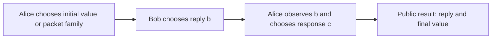

# Action boundaries and subgame perfection

## Recommendation

Use one strategic decision for an uninterrupted player response. Represent its
implementation by the same bounded sequence of transmissions and private
records that the service already permits. Retain decision boundaries across
delivery, inclusion, other players' responses, chance, and clock changes.
Use ordinary canonical SPE on the resulting game.

This removes a dependence on how an implementation decomposes a response. It
does not prove source-to-native SPE preservation. A runtime can still offer a
restricted continuation menu after a genuinely external interaction.

The native service has three consecutive owner invocations after each grant.
The checked [pending-menu impossibility](subgame-preservation.md#status-and-recommendation)
cuts between the second and third. Coalescing that block removes this particular
root. The theorem about the split protocol remains correct; it does not apply
unchanged to the coalesced protocol.

## What may be coalesced

The useful condition concerns information and interaction, not computation cost.
For state `s`, own view `v`, and action `a`, require:

```text
observe(step(s, a)) = update(observe(s), a).
```

The next own view must be computable from the current view and own action.
Private memory, own random choices, and own-action recall can be included in
the view. The block length and legal choices must also be determined by the
entry information. No other principal or environment invocation may interleave.

| Requirement | Why it matters |
|---|---|
| Same packet opportunities | One optional packet cannot replace three possible transmissions. |
| Same packets, order, identities, and binding meanings | The wire can inspect all of them later. |
| Same private recall | Later responses can depend on retained random choices and earlier submissions. |
| Same endpoint state law | Preserves the entire input to every subsequent wire or player continuation. |
| Sampling uses only the entry view | Hidden application state or a hidden service cursor must not become policy inputs. |
| No new information inside the block | A fixed packet batch cannot react to a message received afterward. |
| Correlated sampling | Later internal choices can depend on the player's earlier random choices. |

The generic Lean theorem
[`LocalResponse.transcript_eq_iteration`](../GameTheoryExtensions/Protocol/Coalescing.lean)
samples a finite transcript from the entry view and proves that applying it
has exactly the same full endpoint distribution as successive policy calls.
`continuation_eq` extends the equality through any continuation kernel.
`transcript_length` retains the number of constituent action slots.

The converse needs enough own recall to reproduce the conditional law of the
next action given the already executed prefix. The locality equation alone
does not imply it: a memoryless view can satisfy the equation while losing
correlations between successive calls.

Both directions are checked for a native response:

- [`compileResponse_law`](../Vegas/Pending/NativeResponse.lean) constructs a
  batch sampler from any native invocation policy and proves equality of the
  complete native endpoint law. It applies whenever the counter invariant
  holds, including every initialized native history.
- [`ResponseSampling.run_next`](../GameTheoryExtensions/Protocol/ResponseSampling.lean)
  reconstructs any finitely supported fixed-length list law by conditioning
  on previously selected actions.
- [`sampleResponsePolicy_law`](../Vegas/Pending/NativeResponseSampling.lean)
  realizes such a law through actual native invocations. The policy takes the
  desired law and own recall length at the response entry, then consults only
  its own action records. It preserves arbitrary correlations.

These are laws for one response. Combining the reverse construction into one
playerwise policy for the entire service requires recovering successive response
entries from own recall. The local law alone is not that global theorem.

### Native locality

Own submission allocates a sender-local message identifier. The current view
does not explicitly contain `nextSerial`. On initialized executions this
counter is reconstructed by counting authored submissions in own recall;
replays do not increment it.
[`native_history_counters`](../Vegas/Pending/NativeRecall.lean) proves the
invariant at every legal native history.
[`nativeInput_takeAction`](../Vegas/Pending/NativeLocality.lean) then proves the
local view-update law, including submission, replay, binding, and private recall.
Arbitrary fabricated
executions can have equal views but different counters, so a locality claim
over all raw execution records would be false.

`nativeLocalResponse` instantiates the generic coalescing interface on executions
with the counter invariant. The sampler receives only `NativeInput`; neither
the underlying native state nor the invariant proof enters its observation.

### Choosing the boundary

For the initial owner block, keep the existing budget of three slots, allowing
waits. Keep wire slots and subsequent roster reactions in their original
order. Increasing the packet budget, deleting packets, or treating a send as
replacing a previous pending send would change the runtime's capabilities.

Do not compute a maximal run from a hidden service suffix and disclose its
length to the policy. A response budget must be known from the player's
existing information, or its observation must be an explicit semantic choice.
The fixed initial block is the simplest place to establish that fact.

Using consecutive same-player calls with no environment step is a conservative
criterion. More general coalescing transformations are possible, but require
an information argument for every affected player. In particular, an intervening
wire step is not automatically harmless merely because it leaves the public
application result unchanged.

### Canonical response protocol

[`ResponseProtocol.lean`](../Vegas/Pending/ResponseProtocol.lean) implements
maximal uninterrupted responses as the actions of an `ExecutionProtocol`.
It retains the existing setup, service-order choices, wire instructions,
inclusion, sampling, clocks, and expiry. Termination and a bounded horizon are
checked. `responseLength_prefix` proves that expanding a response recovers
exactly the consumed owner-call prefix; it crosses no external instruction.

[`response_history_native`](../Vegas/Pending/ResponseProtocolRefinement.lean)
proves that every initialized coalesced history has an original native history
with exactly the same state, including the unconsumed service plan. This covers
arbitrary legal response lists and all supported environment choices. It is a
reachability theorem, not an equivalence between the two SPE predicates.

The information model uses the original native view and recall. Constructing
it requires `ResponseBudgetAdequate`: the number of permitted actions must be
computable from that input at every legal response entry. This is the ordinary
requirement that legal action menus respect information sets. It adds no
runtime flag or source syntax.

[`responseBudget_empty_roster`](../Vegas/Pending/ResponseBudget.lean) discharges
the requirement for the service class with no roster reactions: every response
has capacity three. The wire slots remain. For nonempty rosters, initial owner
responses and later reactions can have different capacities; recovering them
from own recall remains an explicit proof obligation. The general protocol
retains those reactions, but its information-model certificate is not yet
instantiated for them.

[`VegasTests/ResponseCoalescing.lean`](../VegasTests/ResponseCoalescing.lean)
constructs the canonical information model for the actual pending-menu example.
It proves that the original two-call execution is unreachable in the coalesced
history tree, while retaining all three competing packets and the next wire
slot. [`InFlightCommitment.lean`](../VegasTests/InFlightCommitment.lean) also
checks the coalesced transition for a received-bit reaction before inclusion.

## Experiment 1: the internal cut

Compare these one-player games:

```text
Split:      choose 0, or continue and then choose 1 or 2.
Coalesced:  choose 0, 1, or 2.
```

Use utilities `u = (3,2,1)` and `v = (3,1,2)` on the three results.
Both games select zero in equilibrium. In the split game, however, a complete
SPE strategy must choose one after `continue` for `u`, and two for `v`.
There is no common complete SPE strategy. The coalesced game has the common
strategy “choose zero.”

Thus a utility-independent translation of complete SPE strategies can fail
under a harmless decomposition of one decision. Equality of equilibrium
outcomes does not suffer this obstruction. The relevant requirement must
specify whether it concerns complete strategies or realizable outcome laws.

This is closely related to standard coalescing and structurally reduced
strategies. Battigalli, Leonetti, and Maccheroni use the same elementary tree
shape in Example 1 and characterize behavioral equivalence using coalescing
and interchange transformations. Their notion identifies strategies differing
only after their own excluded earlier actions. That result does not itself
give our compiler a utility-independent completion to full native SPE.
See [*Behavioral Equivalence of Extensive Game Structures*](https://igier.unibocconi.eu/sites/default/files/media/publication/652.pdf),
Example 1, Definition 4, and Lemma 2.

## Experiment 2: a real intervening response

The second finite experiment has exactly three player turns: Alice, Bob, Alice.



Bob cannot observe Alice's initial choice. Alice knows her own choice and
observes Bob's reply. Bob strictly prefers reply zero, independently of the
final value. Both replies remain legal and must be covered by SPE.

In the **source**, Alice initially fixes a value in `{0,1,2}`. After Bob's reply
she may disclose that value or withhold. The two opening commands have the
same effect; neither changes the already fixed value.

In the **target**, Alice initially chooses either a safe zero or a restricted
family `{1,2}`. After Bob's reply she chooses command zero, command one, or
withholding. In the restricted family:

| Bob's reply | Alice's command 0 | Alice's command 1 | Withhold |
|---|---:|---:|---|
| 0 | 1 | 2 | failure |
| 1 | 2 | 1 | failure |

The family represents two pending, already binding commitments whose eventual
selection can be influenced by later traffic. It does not assign either
commitment a new meaning after submission. This finite game is an abstraction
for testing the design; its first-action menu is not the full native packet
menu, and it has no proved serviced-runtime adapter.

For Alice use:

| Result | 0 | 1 | 2 | failure |
|---|---:|---:|---:|---:|
| `u` | 3 | 2 | 1 | 0 |
| `v` | 3 | 1 | 2 | 0 |

The source profile “fix zero, always disclose; Bob replies zero” is SPE for
both utilities. At source off-path continuations, disclosure remains preferable
to withholding whichever value was fixed.

The target continuation after choosing the restricted family and receiving
reply zero is a proper subgame. Its only remaining decision is Alice's, and
her information identifies the complete preceding history. The earlier root
just before Bob's reply is **not** proper: it cuts Bob's information set across
Alice's different initial choices. The finite checker verifies both facts.

At the proper target root, `u` requires command zero and `v` requires command
one. No single complete target strategy can be SPE for both. Randomization
cannot solve this: each utility can attain two, whereas their sum is at most
three for every possible residual outcome and hence for every residual law.
[`InterleavedMenus.no_common_randomized_completion`](../GameTheoryExtensionsTests/InterleavedMenus.lean)
checks this local argument in Lean. It is not a canonical native SPE theorem.

### Why this response cannot move before Bob's reply

The adaptive rule `c = b` selects value one for both replies. A fixed command
selects one for one reply and two for the other. A mixture of fixed commands
also cannot select one with probability one for both replies.
`InterleavedMenus.no_randomized_fixed_response` checks this distinction.

One can instead choose an entire contingent function before the reply and
execute it after receipt. That retains the message dependency, but then the
"action" describes a policy spanning an external interaction. It is a different
equilibrium interface from one uninterrupted response. Treating all such
policies as single actions can hide precisely the later credibility conditions
we wanted SPE to express.

## Checked results and limits

Run `python scripts/experiments/coalescing.py`. It enumerates complete pure
profiles, checks proper roots by information-set closure, and checks deviations
by replacing an entire player's policy at every root. It does not use a
single-deviation assumption.

| Game | Profiles | SPE for `v` / `u` | Common SPE | SPE result for either utility |
|---|---:|---:|---:|---|
| Split one-player | 4 | 1 / 1 | 0 | zero |
| Coalesced one-player | 3 | 1 / 1 | 1 | zero |
| Interleaved source | 4374 | 64 / 64 | 64 | reply zero, value zero |
| Interleaved target | 324 | 4 / 4 | 0 | reply zero, value zero |

The interleaved games have no adjacent same-player decisions. Their SPE outcome
sets agree in both utility tests. The experiment therefore demonstrates a
remaining complete-strategy issue, not failure of SPE outcome preservation.
It also does not establish that every native implementation has this issue.

The existing native [in-flight-message example](../VegasTests/InFlightCommitment.lean)
checks actual delivery and a policy reaction before inclusion. It establishes
that these observations belong to the runtime behavior that a coalescing
transformation must retain. A native interleaved impossibility additionally
needs reachable histories, full proper-root closure including future moves by
other players, and bounds against arbitrary traffic under the entire service.
Those obligations remain open for a coalesced service.

## Implementation path

1. Recover response capacities from own recall for general reaction rosters.
   Keep the original observation and instantiate the canonical information
   model with its adequacy proof.
2. Construct uniform full-service policy and deviation maps. Recover the
   response entry by parsing own recalled actions into completed batches;
   the budget at each earlier entry is itself a function of that entry's input.
   Then use the checked per-response conditional-sampling law. Do not pass an
   externally supplied entry offset to the global policy.
3. Compare SPE on the response protocol directly; endpoint equivalence alone
   does not equate the two SPE predicates.
4. Test the interleaved restricted-menu mechanism against the actual service.
   A failed continuation certificate must report whether it is a proved
   obstruction or an obligation still requiring a proof.

The action boundary belongs to the runtime semantics. Source commitment
admission remains a separate semantic choice. The requested preservation
property selects a proof obligation; it should not silently pick another
runtime, expand a packet budget, or delete proper subgames.
