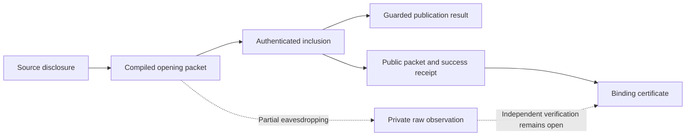

# Communication and evidence around a source game

## Design objective

Keep the game program about binding choices, publication, guards, and results.
Give strategic analysis an explicit account of the communication and evidence
available to its players. Implement that account once per service, rather than
requiring a program to describe packets, inclusion, or cryptographic encodings.

An ordinary commitment has two distinct consequences: it binds a choice and it
gives its owner evidence that can be disclosed. Guard rejection can prevent a
value from becoming an accepted game publication. It cannot retract evidence
already delivered to another player.

The implementation therefore keeps `PublicationResult` unchanged. An
authenticated rejected opening supplies an observation alongside a failed
publication. A `failure(value)` constructor is unnecessary for representing
that observation. Whether the game itself should inspect such a value is a
separate language feature; equilibrium analysis does not require it to do so.

## The programmer-facing abstraction

There are three inputs to strategic analysis:

1. **Game rules:** the existing source program and setup distribution.
2. **Communication service:** opportunities to communicate, delivery audiences,
   and the evidence supplied by the chosen commitment service.
3. **Assessment:** players' strategies and beliefs, including responses after
   unexpected communication.

The commitment interface supplies the evidence capability. It is not an
instruction that the programmer inserts between statements. Strategies can
refer to source facts such as "Alice's commitment named `bid` binds 7". They do
not inspect commitment handles or transaction receipts.

A useful diagnostic should identify the fact and decision whose incentives
conflict, for example: "Bob's continuation assumes Alice's bid is unknown,
but Alice can disclose evidence of that bid before Bob chooses." Producing
such diagnostics automatically remains an analysis task, not a checked
decision procedure in this implementation.

## Claims, certificates, and game results

| Object | Meaning | Effect on the game state |
|---|---|---|
| Claim | A message the sender is free to make, including a false one | None |
| Certificate | Transferable evidence of a particular immutable binding | None |
| Game action | An action admitted by the existing source game | Existing source transition |
| Opening observation | A certificate emitted by a disclosure action | None in addition to that action |

The distinction between claims and certificates is semantic. The abstract
service admits a certificate only if its sender possesses it or previously
received it. This is an ideal evidence assumption; a cryptographic realization
needs computational unforgeability and an appropriate equilibrium definition.
The interface does not claim that raw strings become impossible to transmit.
An attempted forgery must be represented as a claim or other uncertified
observation by a concrete correspondence proof.

The Vegas instance certifies successful commitment bindings. An unopenable
binding provides no opening certificate. A private initial input supplies no
certificate merely by being a private input. Explicit correlations in setup
can allow a commitment certificate to establish a private input indirectly,
as in the checked disclosure counterexample.

Certificates remain available after resolution. A receiver may forward them.
No possession restriction turns an unsupported claim into a certificate.
Public and private delivery are distinct: a private recipient can learn a
fact without its becoming a public game result or a public announcement.

## Concrete semantic service used for the experiment

`Interaction.CommunicationInterface` extends an existing information game.
Its parameters include a claim alphabet and a public finite roster of players.
Before each underlying game transition, each roster entry supplies one optional
communication opportunity. A player can remain silent, make a claim, or send
possessed evidence to one recipient or to everyone. Delivery is immediate at
that semantic opportunity. Repeated roster entries allow multiple exchanges.
Terminal game states stop the execution.

The service has these explicit restrictions:

- Communication is bounded and synchronous. The roster is common knowledge.
- Opportunities occur before each underlying transition, including setup and
  chance transitions; nobody has setup evidence before setup occurs.
- The phase and opportunity position are observable. Private message contents
  and recipient choices are observed only by the sender and recipient.
- Everyone remembers the observations and own actions available at each public
  round. There are no strategic scratch-memory writes or local computation
  costs.
- Finite-horizon sequential analysis additionally requires finite legal menus.
  A finite roster alone does not make an infinite claim alphabet finite.

This is a concrete experiment with an explicit communication service. It is
not a claim that the existing pending-message runtime supplies synchronous
private delivery, nor that real timeouts bound all off-chain communication.
Different delivery or opportunity services need their own game interpretation
and correspondence proof. Allowing more communication is not assumed to make
sequential-equilibrium preservation easier or conservative.

## Checked separation properties

The implementation proves:

- Every admitted certificate is true throughout every legal communication
  history, including after arbitrary forwarding and deviations.
- A received certificate is true at every compatible history in the
  receiver's information set. This conclusion is independent of assessment
  beliefs or equilibrium behavior.
- A fact fixed throughout an information set has a point-mass law under every
  belief on that set.
- Communication leaves the underlying game history unchanged. A game step
  projected onto the underlying state has exactly the original transition law.
- An underlying horizon of `n` and roster length `r` give horizon
  `n * (r + 1)` for the extension. The bound is proved for arbitrary legal play.
- Observation and own-action recall satisfies the library's perfect-recall
  predicate. Decision information sets consequently satisfy its history
  antichain condition.
- The source evidence service is sound for every source program: bindings
  persist through source transitions, and disclosure emits a certificate of
  the binding even if deferred validation rejects its publication.

These are semantic and information guarantees. They do not establish an
equilibrium compiler theorem.

The actual deferred-guard game is instantiated in
[`VegasTests.CommunicationDisclosure`](../VegasTests/CommunicationDisclosure.lean).
Its checked public history retains the original failed publication and exposes
the opening certificate. A second checked history privately discloses the same
certificate before the first source command. The setup correlation then fixes
the original private type at every compatible history: `belief_type` proves
that every belief has the point-mass type law. No `failure(value)` constructor
is used in either history.

| Checked obligation | Module |
|---|---|
| Knowledge and arbitrary-belief consequence | [Knowledge](../GameTheoryExtensions/Protocol/Knowledge.lean) |
| Observation history and perfect recall | [ObservationRecall](../GameTheoryExtensions/Protocol/ObservationRecall.lean) |
| Claims, evidence transfer, selective visibility | [Communication](../Interaction/Communication.lean) |
| Protocol, information-local menus, recall | [CommunicationProtocol](../Interaction/CommunicationProtocol.lean) |
| Legal histories and exact game-step projection | [CommunicationHistory](../Interaction/CommunicationHistory.lean) |
| All-history soundness and knowledge | [CommunicationKnowledge](../Interaction/CommunicationKnowledge.lean) |
| Arbitrary-play horizon and decision antichains | [CommunicationBounded](../Interaction/CommunicationBounded.lean) |
| Source evidence and adapter | [CommitmentEvidence](../Vegas/Source/CommitmentEvidence.lean), [source Communication](../Vegas/Source/Communication.lean) |

## Native evidence correspondence

The reactive disclosure compiler sends an opening whenever the player chooses
disclosure and its binding is openable. It does not consult the publication
verdict when choosing that packet. `reactiveDecision_opening_law` proves that,
at a ready and timely inclusion opportunity with binding provenance, the
compiled packet executes the graph's disclosure transition with its actual
guarded result. The result may be failure. The theorem is local: supplying
that opportunity is a separate service obligation.

Native evidence decoding uses the packet together with a successful application
receipt. Receipt success means the handler authenticated and executed the call;
it does not mean that the game publication succeeded. The decoder produces a
typed graph binding fact, with no handle or envelope identity. Typed context
references then connect that fact to the source commitment name through the
compiler's existing store-agreement relation.

The generic receipt interface proves that every decoded fact remains true at
every later legal history. Its knowledge theorem applies to the full native
response space and to every observation-local restricted menu. Thus every
compatible history has the certified binding, including at information sets
reached only after deviations. This constrains arbitrary beliefs; it does not
construct consistent equilibrium beliefs or establish optimal continuations.

The checked native fixture proves that the actual compiler sends the secret
opening, inclusion still stores publication failure, and every observer receives
the binding certificate. Its passive observation rule is unrestricted.
Existing response normalization and finite-menu compiler coverage also check
with this disclosure rule. The command-service Nash theorem concerns its own
compiler and service; it supplies no missing reactive correctness edge.

| Checked obligation | Module |
|---|---|
| Persistent receipt certificates under arbitrary native play | [ReactiveEvidence](../Interaction/ReactiveEvidence.lean) |
| Knowledge in raw and restricted native information games | [ReactiveEvidenceKnowledge](../Interaction/ReactiveEvidenceKnowledge.lean) |
| Semantic graph binding facts | [graph CommitmentEvidence](../Vegas/EventGraph/CommitmentEvidence.lean) |
| Native packet decoding and handler soundness | [native ReactiveEvidence](../Vegas/Pending/ReactiveEvidence.lean) |
| Compiled disclosure with arbitrary guarded result | [ReactiveDisclosure](../Vegas/Pending/ReactiveDisclosure.lean) |
| Source-name correspondence under store agreement | [EventGraphEvidence](../Vegas/Compile/EventGraphEvidence.lean) |
| Actual rejected-opening compiler and receipt instance | [CommunicationNative](../VegasTests/CommunicationNative.lean) |
| Indistinguishable genuine and false pending opening claims | [CommunicationPending](../VegasTests/CommunicationPending.lean) |

### Pending observations and service design

This is a correspondence for receipt-certified openings. It is not a complete
decoder for every piece of evidence a real commitment can disclose. Raw pending
packets remain visible through the existing partial-leak rule. Their values are
not automatically treated as certificates. Nor does an unsuccessful application
receipt prove that a packet contains no independently verifiable evidence.
An otherwise valid opening may fail because of its address, author, timing, or
application dependencies.

The current runtime exposes each player's own candidate meanings and uses an
internal candidate-value check during handling. It does not expose a separately
verifiable opening witness to receivers. The checked pending-message experiment
makes this distinction concrete. Alice transmits the same claim to open `true`
under either a `true` or a `false` immutable binding. Bob's partial-leak activation
exposes that packet, but gives him identical observations and own-action recall
in both cases. `no_view_verifier` proves that no function of this input can accept
the genuine case and reject the false claim. This concerns authentication in
the present runtime interface; it is not a new equilibrium impossibility theorem.

A backend supporting verification before inclusion needs that capability
explicitly. Exposing the internal value-checking
function as a public observation is not the intended implementation: it would
give receivers a way to test candidate plaintexts without possessing an opening.
[`plaintext_checker_reveals_bit`](../InteractionTests/CommitmentCandidates.lean)
checks this problem for a Boolean binding: asking the internal checker about
`true` returns the hidden bit itself.
The appropriate ideal interface distinguishes possession of an opening witness
from making a bare value claim. Its cryptographic realization and computational
equilibrium interpretation remain future work, as described in
[cryptographic runtime capabilities](cryptographic-runtime-future-work.md).

The service design must consequently retain these distinctions:

- **Knowledge versus inclusion:** a leaked opening can be evidence before any
  contract call executes. Inclusion authorization regulates game effects;
  evidence verification has a separate interface.
- **Evidence versus call authorization:** forwarding a binding certificate and
  replaying an owner's signed game call are different capabilities. A service
  contract must specify both; possession of evidence alone must not silently
  grant the right to act as the commitment owner.
- **Delivery versus audience choice:** partial passive eavesdropping does not
  implement the experimental source service's immediate sender-selected private
  delivery. A native theorem needs a matching delivery law and opportunity set.
- **Responses versus free communication:** one native activation permits one
  optional packet. A semantic service must account for communication that uses
  that opportunity, including openings that also perform a game action.
- **Semantic facts versus packet detail:** facts can use source names while the
  backend accounts for addresses, identifiers, invalid calls and replay. Erasing
  those details requires a strategic correspondence proof at every decision
  information set, not only equality of final game results.

These are requirements for the service correspondence. The native network
retains partial eavesdropping, its existing inclusion rules, and one optional
transmission per response. Communication remains a parameter of strategic
analysis around the source program.

## Preservation target and remaining obligations

### Submission and communication timing

The native commitment compiler chooses and fixes a value when it submits an
envelope. Inclusion later installs that value as the game binding. Between
these events, other players may observe pending messages and respond. The
owner may also submit competing candidates. These are existing protocol
decisions, not private computation steps.

[`ReactiveBinding`](../Vegas/Pending/ReactiveBinding.lean) proves two direct
compiler laws without changing that protocol:

- `reactiveBinding_continuation_result` retains the selected meaning through
  any number of scheduler rounds, for arbitrary player policies, scheduling,
  and partial-leak rules. It covers both values and unopenable bindings.
- `reactiveDecision_binding_continuation_step` proves that including the actual
  compiled envelope performs exactly the selected graph action, including its
  completion history, and produces a success receipt. Its premises check that
  the envelope remains pending and that the event is ready, timely, and has an
  available binding field and handle **at inclusion**.

The checked `binding_after_passive_reaction` fixture in
[`ReactiveRuntime`](../VegasTests/ReactiveRuntime.lean) executes a partial-leak
activation and an arbitrary player's response before including the original
envelope. It proves the resulting binding law for every response policy and
both successful and unopenable commitments. In this fixture the inclusion
premises are proved, rather than assumed.

These laws do not guarantee selection of the original envelope. In particular,
they do not erase a competing submission or its effect on scheduling. Nor do
they permit moving the binding choice to inclusion: a strategy can use its
already fixed value during the intervening communication.

The synchronous source experiment gives communication its own turns before
each immediate game transition. It therefore supplies neither the native
choice-to-inclusion interval nor the coupling between communication and a game
call in one response. The positive theorem needs a source communication
interpretation with those same opportunities and delivery laws. This is a
requirement on the analysis service, not an additional source opcode.

There is also a policy-domain obligation: `Setup.compileReactiveStrategy`
currently accepts the original source behavioral policy. A sequential
assessment of the communication extension has additional decisions and can
condition game choices on received messages. Its compiler must translate that
behavior; the existing compiler's type does not supply this translation.

### Equilibrium correspondence

For a fixed source communication service, the desired theorem starts from an
assessment in the extended source game, including its communication behavior.
It must produce a sequential equilibrium in a corresponding runtime game and
preserve the initialized law of original types and public game results.

The compiler and backend certificate must still establish:

1. Which native observations correspond to claims, certified facts, and public
   announcements, including invalid packets and rejected application calls.
2. Which abstract communication opportunities represent native transmissions
   and passive observations, and with what delivery law and timing.
3. Continuation incentives at every native decision information set, including
   histories reached after multiple deviations.
4. A common consistent belief construction from fully mixed approximations.
5. Finite legal menus, or a separately justified extension of the equilibrium
   machinery, for the admitted communication alphabet.

The receipt and local compilation laws above discharge part of the first
obligation. They do not identify the experimental synchronous communication
service with the native pending-message service. A positive theorem must first
specify the corresponding extended source game and justify that service edge.

The existing Nash theorem retains its stated target and service assumptions.
It is not automatically a theorem about every communication extension. The
unrestricted sequential-preservation impossibility for the original source
observations also remains valid. The proposed source semantics changes the
information game to address its disclosure mismatch; it does not refute that
theorem.

## Ownership and alternatives

| Layer | Responsibility |
|---|---|
| `GameTheoryExtensions` | Knowledge in information sets, belief consequences, observation recall |
| `Interaction` | Claims and evidence, audiences, communication opportunities, protocol extension |
| `Vegas.Source` | Source commitment facts, possession, persistence, opening observations |
| `Vegas.EventGraph` | Typed binding facts independent of native handles |
| `Vegas.Compile` | Source-name and graph-fact correspondence |
| `Vegas.Pending` | Native evidence decoding, compiler packets, handler and service laws |
| `Vegas.Game` | Composition into the intended strategic correspondence |

The design deliberately keeps game results and observations separate. An
alternative that annotates only failed publication results would still need an
account of private or earlier disclosure. An alternative that reproduces the
native message machine as the source semantics would give programmers the
wrong level of abstraction. An alternative that silently makes all private
values public would remove information structures the language is meant to
describe.

Communication extensions of games are standard; their timing and equilibrium
guarantees require explicit analysis. See Geffner and Halpern,
[Communication games, sequential equilibrium, and mediators, Section 2.2](https://arxiv.org/html/2309.14618v3).
That paper is background, not a proof of the service correspondence proposed
here. Cryptographic services that change possession or disclosure capabilities
are discussed in [cryptographic future work](cryptographic-runtime-future-work.md).
