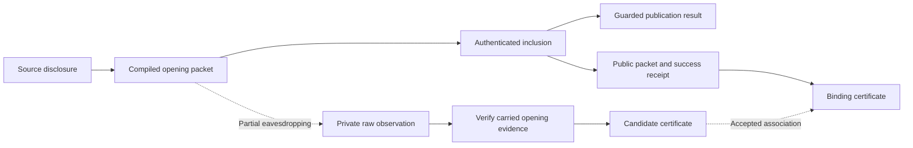

# Communication and evidence around a source game

## Design objective

Keep the game program about binding choices, publication, guards, and results.
Give strategic analysis an explicit account of the communication and evidence
available to its players. Implement that account once per service, rather than
requiring a program to describe packets, inclusion, or cryptographic encodings.

The proof target has two parts: a disclosure capability that an implementation
cannot uniformly hide, and a sufficient abstract account of the strategic
differences that remain. A theorem about packet mechanics alone does not settle
this boundary. The [theorem contract](#theorem-contract) and
[implementation gates](#direct-implementation-order) below specify the intended
results; general native preservation is not yet proved.

An ordinary commitment has two distinct consequences: it binds a choice and it
gives its owner evidence that can be disclosed. Guard rejection can prevent a
value from becoming an accepted game publication. It cannot retract evidence
already delivered to another player.

The implementation therefore keeps `PublicationResult` unchanged. An
authenticated rejected opening supplies an observation alongside a failed
publication. A `failure(value)` constructor is unnecessary for representing
that observation. Whether the game itself should inspect such a value is a
separate language feature; equilibrium analysis does not require it to do so.

## The programmer-facing abstraction

There are three inputs to strategic analysis:

1. **Game rules:** the existing source program and setup distribution.
2. **Communication service:** opportunities to communicate, delivery audiences,
   and the evidence supplied by the chosen commitment service.
3. **Assessment:** players' strategies and beliefs, including responses after
   unexpected communication.

The commitment interface supplies the evidence capability. It is not an
instruction that the programmer inserts between statements. Strategies can
refer to source facts such as "Alice's commitment named `bid` binds 7". They do
not inspect commitment handles or transaction receipts.

A useful diagnostic should identify the fact and decision whose incentives
conflict, for example: "Bob's continuation assumes Alice's bid is unknown,
but Alice can disclose evidence of that bid before Bob chooses." Producing
such diagnostics automatically remains an analysis task, not a checked
decision procedure in this implementation.

## Pending observation and public recording

The preservation candidate uses a communication environment with two observable
events: a player submits a message that other players may notice, and the service
may later record that message publicly. These are stages in the life of the
same message. Public recording does not require acceptance of an accompanying
game request. A message can carry a claim or possessed evidence without asking
the game to change state.

Three questions must remain separate:

| Question | Meaning |
|---|---|
| Was the message observed? | A recipient learns its contents, possibly before recording. |
| Does it contain valid evidence? | A witness establishes a binding fact independently of game acceptance. |
| Did its game request take effect? | The source rules determine the transition and publication result. |

An included opening can consequently disclose a binding while its game request
is rejected, or while an executed disclosure produces publication failure.
Those are different application outcomes with a shared information consequence
when the opening is independently verifiable. A failed receipt alone certifies
neither the truth nor the falsity of the claimed opening. The existing
receipt-certified evidence laws cover only their stated successful-handler case.

This interpretation has a concrete Ethereum motivation. Execution clients
[gossip transactions and keep local transaction pools](https://ethereum.org/developers/docs/networking-layer/).
An included transaction's
[calldata belongs to the block record](https://ethereum.org/developers/docs/data-availability/blockchain-data-storage-strategies/).
Execution can [revert its state changes and logs](https://eips.ethereum.org/EIPS/eip-140)
and leave a [failure status in its receipt](https://eips.ethereum.org/EIPS/eip-658).
Thus reverting the game call does not erase the transaction's supplied opening.
This motivation concerns transaction input, not the persistence of reverted logs
or return data. A game-invalid call can still be carried in a network-valid
transaction; arbitrary invalid envelopes are not assumed to propagate.

The mathematical environment still needs explicit assumptions. Partial
observation and inclusion probabilities are modeling choices, not consequences
of gossip. Submission does not guarantee recording before another decision or
deadline; a required liveness guarantee needs its own service premise and proof.
A public record observed by every player abstracts monitoring,
confirmation, and finality; it is not a claim of instantaneous common knowledge
on Ethereum. Bounded responses and message alphabets are resource restrictions,
not consequences of game timeouts alone. Transactions also
[require fees](https://ethereum.org/developers/docs/transactions/): the proposed
fee-free utility analysis concerns game payoffs, not actual net monetary returns
after execution costs. Scheduler incentives and fee effects are not proved by
this model.

The source environment describes messages, evidence, recording, and attempted
source actions. It must be specified independently of the compiled handler.
Source strategies use named game facts rather than native commitment encodings.
Observable implementation details can nevertheless carry signals. A compiler
proof must represent those signals as communication or justify their erasure;
equal terminal game results alone do not justify dropping them.

## Claims, certificates, and game results

| Object | Meaning | Effect on the game state |
|---|---|---|
| Claim | A message the sender is free to make, including a false one | None |
| Certificate | Transferable evidence of a particular immutable binding | None |
| Game action | An action admitted by the existing source game | Existing source transition |
| Opening observation | A certificate emitted by a disclosure action | None in addition to that action |

The distinction between claims and certificates is semantic. The abstract
service admits a certificate only if its sender possesses it or previously
received it. This is an ideal evidence assumption; a cryptographic realization
needs computational unforgeability and an appropriate equilibrium definition.
The interface does not claim that raw strings become impossible to transmit.
An attempted forgery must be represented as a claim or other uncertified
observation by a concrete correspondence proof.

The Vegas instance certifies successful commitment bindings. An unopenable
binding provides no opening certificate. A private initial input supplies no
certificate merely by being a private input. Explicit correlations in setup
can allow a commitment certificate to establish a private input indirectly,
as in the checked disclosure counterexample.

Certificates remain available after resolution. A receiver may forward them.
No possession restriction turns an unsupported claim into a certificate.
Public and private delivery are distinct: a private recipient can learn a
fact without its becoming a public game result or a public announcement.

## Concrete semantic service used for the experiment

`Interaction.CommunicationInterface` extends an existing information game.
Its parameters include a claim alphabet and a public finite roster of players.
Before each underlying game transition, each roster entry supplies one optional
communication opportunity. A player can remain silent, make a claim, or send
possessed evidence to one recipient or to everyone. Delivery is immediate at
that semantic opportunity. Repeated roster entries allow multiple exchanges.
Terminal game states stop the execution.

The service has these explicit restrictions:

- Communication is bounded and synchronous. The roster is common knowledge.
- Opportunities occur before each underlying transition, including setup and
  chance transitions; nobody has setup evidence before setup occurs.
- The phase and opportunity position are observable. Private message contents
  and recipient choices are observed only by the sender and recipient.
- Everyone remembers the observations and own actions available at each public
  round. There are no strategic scratch-memory writes or local computation
  costs.
- Finite-horizon sequential analysis additionally requires finite legal menus.
  A finite roster alone does not make an infinite claim alphabet finite.

This is a concrete experiment with an explicit communication service. It is
not a claim that the existing pending-message runtime supplies synchronous
private delivery, nor that real timeouts bound all off-chain communication.
Different delivery or opportunity services need their own game interpretation
and correspondence proof. Allowing more communication is not assumed to make
sequential-equilibrium preservation easier or conservative.

## Checked separation properties

The implementation proves:

- Every admitted certificate is true throughout every legal communication
  history, including after arbitrary forwarding and deviations.
- A received certificate is true at every compatible history in the
  receiver's information set. This conclusion is independent of assessment
  beliefs or equilibrium behavior.
- A fact fixed throughout an information set has a point-mass law under every
  belief on that set.
- Communication leaves the underlying game history unchanged. A game step
  projected onto the underlying state has exactly the original transition law.
- An underlying horizon of `n` and roster length `r` give horizon
  `n * (r + 1)` for the extension. The bound is proved for arbitrary legal play.
- Observation and own-action recall satisfies the library's perfect-recall
  predicate. Decision information sets consequently satisfy its history
  antichain condition.
- The source evidence service is sound for every source program: bindings
  persist through source transitions, and disclosure emits a certificate of
  the binding even if deferred validation rejects its publication.

These are semantic and information guarantees. They do not establish an
equilibrium compiler theorem.

The actual deferred-guard game is instantiated in
[`VegasTests.CommunicationDisclosure`](../VegasTests/CommunicationDisclosure.lean).
Its checked public history retains the original failed publication and exposes
the opening certificate. A second checked history privately discloses the same
certificate before the first source command. The setup correlation then fixes
the original private type at every compatible history: `belief_type` proves
that every belief has the point-mass type law. No `failure(value)` constructor
is used in either history.

| Checked obligation | Module |
|---|---|
| Knowledge and arbitrary-belief consequence | [Knowledge](../GameTheoryExtensions/Protocol/Knowledge.lean) |
| Observation history and perfect recall | [ObservationRecall](../GameTheoryExtensions/Protocol/ObservationRecall.lean) |
| Claims, evidence transfer, selective visibility | [Communication](../Interaction/Communication.lean) |
| Protocol, information-local menus, recall | [CommunicationProtocol](../Interaction/CommunicationProtocol.lean) |
| Legal histories and exact game-step projection | [CommunicationHistory](../Interaction/CommunicationHistory.lean) |
| All-history soundness and knowledge | [CommunicationKnowledge](../Interaction/CommunicationKnowledge.lean) |
| Arbitrary-play horizon and decision antichains | [CommunicationBounded](../Interaction/CommunicationBounded.lean) |
| Source evidence and adapter | [CommitmentEvidence](../Vegas/Source/CommitmentEvidence.lean), [source Communication](../Vegas/Source/Communication.lean) |

## Native evidence correspondence

The reactive disclosure compiler sends an opening whenever the player chooses
disclosure and its binding is openable. It does not consult the publication
verdict when choosing that packet. `reactiveDecision_opening_law` proves that,
at a ready and timely inclusion opportunity with binding provenance, the
compiled packet executes the graph's disclosure transition with its actual
guarded result. The result may be failure. The theorem is local: supplying
that opportunity is a separate service obligation.

Native evidence decoding uses the packet together with a successful application
receipt. Receipt success means the handler authenticated and executed the call;
it does not mean that the game publication succeeded. The decoder produces a
typed graph binding fact, with no handle or envelope identity. Typed context
references then connect that fact to the source commitment name through the
compiler's existing store-agreement relation.

The generic receipt interface proves that every decoded fact remains true at
every later legal history. Its knowledge theorem applies to the full native
response space and to every observation-local restricted menu. Thus every
compatible history has the certified binding, including at information sets
reached only after deviations. This constrains arbitrary beliefs; it does not
construct consistent equilibrium beliefs or establish optimal continuations.

The checked native fixture proves that the actual compiler sends the secret
opening, inclusion still stores publication failure, and every observer receives
the binding certificate. Its passive observation rule is unrestricted.
Existing response normalization and finite-menu compiler coverage also check
with this disclosure rule. The command-service Nash theorem concerns its own
compiler and service; it supplies no missing reactive correctness edge.

| Checked obligation | Module |
|---|---|
| Persistent receipt certificates under arbitrary native play | [ReactiveEvidence](../Interaction/ReactiveEvidence.lean) |
| Knowledge in raw and restricted native information games | [ReactiveEvidenceKnowledge](../Interaction/ReactiveEvidenceKnowledge.lean) |
| Semantic graph binding facts | [graph CommitmentEvidence](../Vegas/EventGraph/CommitmentEvidence.lean) |
| Native packet decoding and handler soundness | [native ReactiveEvidence](../Vegas/Pending/ReactiveEvidence.lean) |
| Compiled disclosure with arbitrary guarded result | [ReactiveDisclosure](../Vegas/Pending/ReactiveDisclosure.lean) |
| Source-name correspondence under store agreement | [EventGraphEvidence](../Vegas/Compile/EventGraphEvidence.lean) |
| Actual rejected-opening compiler and receipt instance | [CommunicationNative](../VegasTests/CommunicationNative.lean) |
| Transferable opening evidence, separate from the call | [OpeningEvidence](../Vegas/Pending/OpeningEvidence.lean) |
| Evidence truth at every compatible native history | [ReactivePacketEvidence](../Interaction/ReactivePacketEvidence.lean) and its [Vegas instance](../Vegas/Pending/ReactivePacketEvidence.lean) |
| Same-response issuance, partial observation, forwarding, rejection | [ReactiveWitnessedEvidence](../VegasTests/ReactiveWitnessedEvidence.lean) |
| Indistinguishable genuine and false unauthenticated pending claims | [CommunicationPending](../VegasTests/CommunicationPending.lean) |

### Pending observations and service design

This is a correspondence for receipt-certified openings. It is not a complete
decoder for every piece of evidence a real commitment can disclose. Raw pending
packets remain visible through the existing partial-leak rule. Their values are
not automatically treated as certificates. Nor does an unsuccessful application
receipt prove that a packet contains no independently verifiable evidence.
An otherwise valid opening may fail because of its address, author, timing, or
application dependencies.

The native packet contains an application call and optional ideal opening
evidence. A submission can request evidence for an owned candidate, copy evidence
from a previously observed packet, or omit evidence. Issuance occurs after the
submission fixes its candidate, within the same response. There is no additional
preparation turn. The emitted certificate stays fixed across passive observation,
forwarding, replay, inclusion, and rejection. False claims remain legal packets;
an unavailable certificate request simply produces no evidence.

An opening certificate states the value of a **candidate**, including one still
pending. It does not establish that this candidate won a source binding. A
successful binding association supplies that separate fact. Forwarding a
certificate does not authenticate the forwarder's application call as the
candidate owner's call. The soundness and information-fiber theorems quantify
over arbitrary native play and partial passive-observation rules.

The [pending-message experiment](../VegasTests/CommunicationPending.lean)
compares **unauthenticated** claims: Alice sends the same raw claim to open
`true`, with no certificate, under either a `true` or a `false` binding. Bob has
identical observations in both cases. Its `no_view_verifier` theorem concerns
these bare claims, not the separately carried evidence. The certificate tests
show that certified disclosure is distinguishable and remains usable when the
attached application call is rejected.

The internal candidate-value checker is not a public observation: exposing it
would let receivers test plaintext guesses without possessing an opening.
[`plaintext_checker_reveals_bit`](../InteractionTests/CommitmentCandidates.lean)
checks this problem for Boolean bindings. Evidence issuance instead uses only
the sender's owned candidate meanings or evidence already possessed in known
packets. Its cryptographic realization and computational equilibrium
interpretation remain future work, as described in
[cryptographic runtime capabilities](cryptographic-runtime-future-work.md).

The service design must consequently retain these distinctions:

- **Knowledge versus inclusion:** a leaked opening can be evidence before any
  contract call executes. Inclusion authorization regulates game effects;
  evidence verification has a separate interface.
- **Evidence versus call authorization:** forwarding a binding certificate and
  replaying an owner's signed game call are different capabilities. A service
  contract must specify both; possession of evidence alone must not silently
  grant the right to act as the commitment owner.
- **Delivery versus audience choice:** partial passive eavesdropping does not
  implement the experimental source service's immediate sender-selected private
  delivery. A native theorem needs a matching delivery law and opportunity set.
- **Responses versus free communication:** one native activation permits one
  optional packet. A semantic service must account for communication that uses
  that opportunity, including openings that also perform a game action.
- **Semantic facts versus packet detail:** facts can use source names while the
  backend accounts for addresses, identifiers, invalid calls and replay. Erasing
  those details requires a strategic correspondence proof at every decision
  information set, not only equality of final game results.

These are requirements for the service correspondence. The native network
retains partial eavesdropping, its existing inclusion rules, and one optional
transmission per response. Communication remains a parameter of strategic
analysis around the source program.

## Preservation target and remaining obligations

### Theorem contract

Write `G` for the source game with setup, `C(G, k)` for its communication
interpretation under a public environment configuration `k`, and `T(G, r)` for
the compiled native game under runtime configuration `r`. These names describe
the statements; they do not require three new Lean structures. Utilities have
domain original private types and public game results, `Theta x Omega`.

**N. Capability-based impossibility.** Extract the abstract and native
disclosure proofs into a theorem about information and continuation choices.
Its witness supplies one source assessment that is an SE for two opposite
guessing utilities. In the target, there is a legal decision information set
where every compatible history fixes the relevant bit, the player can obtain
either guess, and the continuation laws force opposite behavior under those
utilities. No utility-independent strategy translator can preserve both source
equilibria, even with utility-dependent target beliefs. The information and
choice premises must be derived from disclosure, verification, and actual
remaining opportunities for each runtime instance. Merely stating that a
runtime permits some communication is insufficient.

This is a lower bound for the stated capability class and source witness, not
for all blockchain protocols, all games, or utility-dependent synthesis. A
legal off-path disclosure opportunity is enough for this proof when it supplies
the specified decision witness; disclosure need not occur during prescribed
play. A general capability theorem and its native instantiation are required
in addition to the already checked particular-game impossibility.

**C. Conservation of game rules.** Communication-only transitions leave the
underlying game state unchanged. At a game transition, projection gives the
original source kernel for that game action, including its guarded result.
Utilities factor through original types and results. Information may be added
even when the result is failure. This is conservation of the game rules, not
equality of the games' strategy spaces or equilibrium sets. Communication-aware
strategies can condition actions on information absent from `G`; projecting
their traces does not automatically give admissible policies of `G`.
The synchronous experiment proves local instances of this property. The
pending-observation interpretation needs its own proof.

**S. Sufficient communication abstraction.** Fix `k`, `r`, and operational
implementation assumptions before choosing utilities. Construct a playerwise
compiler whose behavior depends on the configured environment and its player's
source policy, not on utilities, opponents' policies, or assessment beliefs.
For every assessment `A` that is an SE of `C(G, k)`, construct native beliefs
such that the compiled strategy is an SE of `T(G, r)`. Preserve the initialized
joint law of original types and public results for every source profile.
The proof must account for continuation deviations and observations at every
native decision information set, including after earlier own deviations.
Beliefs may depend on the source assessment. They are not runtime inputs.

The operational assumptions must have a concrete native instance. They cannot
be a field asserting equilibrium preservation or an uninstantiated strategic
simulation. An independently specified account of communication is the proposed
explanation of the remaining differences; its sufficiency is a proof obligation.
One-way preservation at compiled profiles does not assert reflection or equality
of all native and source equilibrium outcomes.

**R. Reuse of original equilibria.** If an assessment of `G` has an SE extension
in `C(G, k)` with the same intended original type/result law, S yields a native
SE with that law. The extension must specify communication behavior, responses
after unexpected messages, and consistent beliefs. No disclosure along the
prescribed play is not a sufficient premise. Silence can be informative, and
ordinary messages can coordinate behavior without certifying a hidden value.
Checking such extensions or giving useful sufficient conditions is separate
from the compiler proof; there is no claimed automatic decision procedure.

### Semantic boundary and configuration

- The core program, private-input sort, and `PublicationResult` stay unchanged.
  Use the full source commitment interface, including forfeiture, for the first
  positive theorem. Eliding a failure choice requires a separate preservation
  proof. There is no `failure(value)` constructor or communication opcode.
- Communication supplies arbitrary claims within a declared finite alphabet
  and transferable evidence that the sender possesses. A private input alone
  supplies no certificate. Evidence can be disclosed outside the game's
  publication interface, including before a reveal or despite rejection.
- Messages can be privately noticed while pending and later recorded publicly.
  Possession of an opening witness permits verification independently of game
  acceptance. Recording, verification, and game effects are separate. Declared
  opportunities must account for an opening that communicates and requests a
  game effect in the same response, and for the actual remaining budget.
- `k` specifies finite opportunities, passive observation, public recording,
  and their order relative to game decisions. Use existing scheduling and
  observation types where they fit. The concrete first instance supplies no
  guaranteed sender-selected private delivery. Service randomness is chance,
  not a player or a source of private observation reports to the scheduler.
- Specify `C(G, k)` from source rules and communication capabilities. Do not
  define it by decoding the compiled handler. Semantic message references may
  identify repeated observations of a message; native encodings and handles
  are implementation details whose treatment requires proof. If those details
  carry a signal, retain the signal as communication or prove it irrelevant.
- A submitted candidate's meaning is fixed before inclusion. Evidence for an
  unaccepted candidate does not yet prove the value of a named source binding:
  the accepted association needs a separate justification. Full native coverage
  includes multiple candidates and commitments outside the current source
  binding store. A model of accepted bindings alone is not assumed sufficient.
  If these capabilities require more than the proposed communication extension,
  exhibit that obstruction before enlarging the source interface.

The programmer analyzes source choices and semantic communications under the
declared opportunities. The implementation proof bears the burden of native
admission checks, rejection, replay, competing submissions, and inclusion.
Importing those native choices unchanged into `C(G, k)` would weaken the claimed
abstraction and must be reported as such. A reusable implementation of the
communication environment does not by itself establish strategic abstraction.

### Assumption discipline

| Boundary | Required treatment |
|---|---|
| Commitments and evidence | Ideal binding and possessed-witness verification, with all-history soundness proofs; computational realization remains future work |
| Finite analysis | Explicit value/message menus and interaction horizon; prove coverage and termination for the admitted runtime, not for arbitrary unbounded traffic |
| Private computation | Free behavioral choice based on observation and own-action recall; no strategic scratch-memory operations |
| Pending observations | Foreign messages only, partial observations permitted, no private leak report in scheduler state |
| Inclusion | At most once per envelope, including rejected calls; fresh retransmission remains possible |
| Selection and opportunities | State the particular operational laws used in the proof; identity-obliviousness or local selection regularity alone is not a proved sufficiency condition |
| Dependencies | Any restriction on submission-time authorization requires an implementable witness; the existing public-history monitor is not a verified ledger mechanism |
| Public recording | Explicit monitoring and finality abstraction; no inference of instantaneous common knowledge from real-world inclusion |
| Payoffs | Original types and results; gas fees, bribery, and trace-sensitive utilities require additional modeling |

Assumptions controlling opportunities and selection are not yet known sufficient
for S. The proof will identify the required laws and exhibit a concrete instance;
the accompanying documentation must distinguish Lean consequences from
engineering justification. A counterexample under weaker laws records an
actual limit; there is no promise of a globally weakest service contract.

### Direct implementation order

1. **Generalize the lower bound.** Move the reusable information/continuation
   argument into `GameTheoryExtensions`, and derive its premises for the actual
   native witness. Keep the particular source assessment and runtime fixture
   as theorem instances. Gate: N applies through operationally verified
   capabilities, independently of a particular strategy compiler.
2. **Close the concrete evidence gap.** Add possessed-witness verification where
   the native commitment interface belongs. Prove validity under arbitrary
   play, including pending observation, forwarding, and application rejection.
   An opening witness is not authority to act as the owner, and verification
   is not a public oracle for testing plaintexts.
3. **Prove the small positive case end to end.** Give the actual deferred-guard
   example its independent communication interpretation and compile its
   communication-aware policies. Prove C, the needed continuation correspondence,
   and an SE-preservation instance with a common consistency witness. Include
   passive pending observation and recorded failed publication. The original
   counterexample assessment is not presumed to survive the extension. Gate:
   an actual nonvacuous positive assessment and transfer theorem, not merely
   sound evidence or matching terminal marginals.
4. **Establish native coverage.** Extend the argument to competing candidates,
   off-path rejection, replay, earlier own deviations, and actual remaining
   deadlines and transmission opportunities. Derive service premises from a
   concrete instance. Record the first unmatched capability as a precise
   obstruction. Do not make the abstract game a copy of the native machine to
   avoid that obstruction.
5. **Generalize to source programs.** Reuse the source-to-graph step laws and
   actual native binding/disclosure laws. Prove policy translation, joint-law
   correctness, and continuation incentive transport for the admitted source
   language and service. Extract only reusable proof lemmas needed by that
   construction into `GameTheoryExtensions` or `Interaction`.
6. **Finish S and R.** Lift one common sequence of fully mixed source assessments
   to native assessments, covering every admitted native response, then prove
   convergence and rationality. The small-case consistency construction must
   generalize with the compiler. Consistent-completion existence alone is
   insufficient. State the original-equilibrium extension corollary and report
   the exact remaining runtime assumptions alongside the checked theorem.

Every gate produces a checked theorem or a checked obstruction. Reuse existing
models and remove superseded experiments when their useful facts have a home.
No new service taxonomy, equilibrium definition, boolean preservation flag,
cryptographic implementation, or automated equilibrium solver is required.
Generic lemmas must have concrete callers in this proof. Work stays in the root
project; the GameTheory submodule is not an implementation target.

### Submission and communication timing

The native commitment compiler chooses and fixes a value when it submits an
envelope. Inclusion later installs that value as the game binding. Between
these events, other players may observe pending messages and respond. The
owner may also submit competing candidates. These are existing protocol
decisions, not private computation steps.

[`ReactiveBinding`](../Vegas/Pending/ReactiveBinding.lean) proves two direct
compiler laws without changing that protocol:

- `reactiveBinding_continuation_result` retains the selected meaning through
  any number of scheduler rounds, for arbitrary player policies, scheduling,
  and partial-leak rules. It covers both values and unopenable bindings.
- `reactiveDecision_binding_continuation_step` proves that including the actual
  compiled envelope performs exactly the selected graph action, including its
  completion history, and produces a success receipt. Its premises check that
  the envelope remains pending and that the event is ready, timely, and has an
  available binding field and handle **at inclusion**.

The checked `binding_after_passive_reaction` fixture in
[`ReactiveRuntime`](../VegasTests/ReactiveRuntime.lean) executes a partial-leak
activation and an arbitrary player's response before including the original
envelope. It proves the resulting binding law for every response policy and
both successful and unopenable commitments. In this fixture the inclusion
premises are proved, rather than assumed.

These laws do not guarantee selection of the original envelope. In particular,
they do not erase a competing submission or its effect on scheduling. Nor do
they permit moving the binding choice to inclusion: a strategy can use its
already fixed value during the intervening communication.

The synchronous source experiment gives communication its own turns before
each immediate game transition. It therefore supplies neither the native
choice-to-inclusion interval nor the coupling between communication and a game
call in one response. The positive theorem needs a source communication
interpretation with those same opportunities and delivery laws. This is a
requirement on the analysis service, not an additional source opcode.

There is also a policy-domain obligation: `Setup.compileReactiveStrategy`
currently accepts the original source behavioral policy. A sequential
assessment of the communication extension has additional decisions and can
condition game choices on received messages. Its compiler must translate that
behavior; the existing compiler's type does not supply this translation.

### Source meaning of auxiliary commitments

Native players can create a candidate in a call that is rejected or loses to
another candidate, then disclose its certificate or reuse the candidate later.
The named-binding source evidence interface has no fact for such a candidate
before association with a game commitment. Treating that evidence as a bare
claim would discard its verification guarantee; treating it as a named source
binding would assert an association that has not happened.

The direct operational proof therefore needs either an independently specified
ambient ideal-commitment capability or a theorem eliminating these auxiliary
commitments. An ambient capability can use owner-scoped labels and immutable
values, with creation bundled into communication and association performed only
when the game accepts the binding. This belongs to the analysis environment,
not the program's syntax. Reusing the existing ideal commitment machinery is
the implementation candidate; the correspondence is not proved. This gap in
exact capability simulation is not itself a proof that every possible SE
translator requires the richer environment.

### Usable response opportunities

The native disclosure fixture has complete sequential equilibria, but its
calendar is insufficient as a source implementation: all owner responses occur
before timeout settlement. An earlier omission can leave a dependent owner
with no response after its event becomes ready. Termination alone does not
establish opportunity coverage.

The operational proof must provide timely owner responses after predecessor
success **or failure**, under arbitrary earlier behavior. The existing recurring
epoch service supplies a checked opportunity result in
[ReactiveServiceOpportunity](../Vegas/Pending/ReactiveServiceOpportunity.lean):
under the existing deadline-at-least-two assumption, an event newly activated
during an epoch is ready and timely at its next reserved owner visit, or has
already completed. The [deferred-guard instance](../VegasTests/CommunicationServiceOpportunity.lean)
covers arbitrary prior epochs and behavior. Competing
submissions, partial pending observations, and publication of rejected side
traffic remain separate correspondence obligations. A schedule that advances
time after completing a predecessor must account for the dependent deadline,
which begins at that completion; padding with waits cannot silently erase elapsed
time.

### Equilibrium correspondence

For a fixed source communication service, the desired theorem starts from an
assessment in the extended source game, including its communication behavior.
It must produce a sequential equilibrium in a corresponding runtime game and
preserve the initialized law of original types and public game results.

The compiler and backend certificate must still establish:

1. Which native observations correspond to claims, certified facts, and public
   announcements, including invalid packets and rejected application calls.
2. Which abstract communication opportunities represent native transmissions
   and passive observations, and with what delivery law and timing.
3. Continuation incentives at every native decision information set, including
   histories reached after multiple deviations.
4. A common consistent belief construction from fully mixed approximations.
5. Finite legal menus, or a separately justified extension of the equilibrium
   machinery, for the admitted communication alphabet.

The receipt and local compilation laws above discharge part of the first
obligation. They do not identify the experimental synchronous communication
service with the native pending-message service. A positive theorem must first
specify the corresponding extended source game and justify that service edge.

The existing Nash theorem retains its stated target and service assumptions.
It is not automatically a theorem about every communication extension. The
unrestricted sequential-preservation impossibility for the original source
observations also remains valid. The proposed source semantics changes the
information game to address its disclosure mismatch; it does not refute that
theorem.

## Ownership and alternatives

| Layer | Responsibility |
|---|---|
| `GameTheoryExtensions` | Knowledge in information sets, belief consequences, observation recall |
| `Interaction` | Claims and evidence, audiences, communication opportunities, protocol extension |
| `Vegas.Source` | Source commitment facts, possession, persistence, opening observations |
| `Vegas.EventGraph` | Typed binding facts independent of native handles |
| `Vegas.Compile` | Source-name and graph-fact correspondence |
| `Vegas.Pending` | Native evidence decoding, compiler packets, handler and service laws |
| `Vegas.Game` | Composition into the intended strategic correspondence |

The design deliberately keeps game results and observations separate. An
alternative that annotates only failed publication results would still need an
account of private or earlier disclosure. An alternative that reproduces the
native message machine as the source semantics would give programmers the
wrong level of abstraction. An alternative that silently makes all private
values public would remove information structures the language is meant to
describe.

Communication extensions of games are standard; their timing and equilibrium
guarantees require explicit analysis. See Geffner and Halpern,
[Communication games, sequential equilibrium, and mediators, Section 2.2](https://arxiv.org/html/2309.14618v3).
That paper is background, not a proof of the service correspondence proposed
here. Cryptographic services that change possession or disclosure capabilities
are discussed in [cryptographic future work](cryptographic-runtime-future-work.md).
