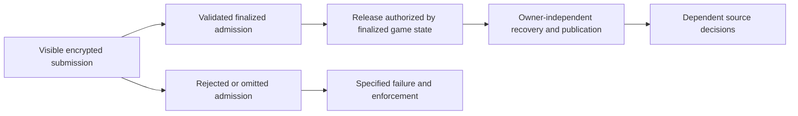

# A concrete blockchain target for SE preservation

Analysis by Codex. This proposes a deployable service architecture and separates
its proof obligations from the properties of existing chains. It does not
adopt new semantics or change the [async checklist](se-async-checklist.md).
The checked results and other paper arguments are catalogued in the
[preservation landscape](equilibrium-preservation-landscape.md).

The most concrete starting point is a confidential contract on a chain with
BFT finality, such as Oasis Sapphire. A threshold-decryption system attached to
an EVM host chain, such as Zama's FHEVM, offers another implementation route.
Neither requires hiding the existence of pending messages. Both can keep
ciphertexts observable while controlling release of their contents.

The program's fixed horizon is useful: it can bound the number of physical
opportunities once the backend supplies a bound per logical event. It cannot
by itself establish positive failure probability for a strategic departure.
Furthermore, the relevant probability must be conditional on what the player
knows and must represent an additional cost relative to faithful execution.

## Existing blockchain components

| Architecture | Relevant properties | Additional obligations for our theorem |
| --- | --- | --- |
| Oasis Sapphire | Encrypted calldata, private contract state, BFT finality | TEE and cryptographic assumptions; safe release logic; trace leakage; admission and delivery bounds |
| Secret Network | Encrypted inputs/state/output, SGX execution, Tendermint consensus | Similar confidentiality and liveness obligations; a public-release protocol |
| Zama FHEVM on a host chain | Encrypted inputs, contract decryption permissions, threshold-MPC key management | Finalized authorization, reliable decryption/publication, and the gap between plaintext knowledge and ledger effect |
| Shutter on Gnosis | Encrypted transaction flow with keypers | Distinguish selected/proposed transactions from finalized admission, and epoch release from selective release |

Sapphire documents encrypted transaction inputs and private state, together
with finality of validated blocks. These are genuine blockchain features.
Finality is relative to the consensus fault assumptions; it does not imply a
particular transaction is admitted within a bounded number of blocks.
[Sapphire architecture and finality](https://docs.oasis.io/build/sapphire/ethereum/)

There is a particularly relevant operational issue. Sapphire's security guide
shows how a simulated call can obtain a secret by simulating the payment that
authorizes disclosure. Its mitigation records the admission block and requires
a later block before returning the secret. The same guide documents observable
storage access, gas and transaction-size leakage, and padding mechanisms. These
give us specific compiler obligations rather than a hypothetical invisible
mempool.
[Sapphire security guide](https://docs.oasis.io/build/sapphire/develop/security/)

Secret Network is another confidential-ledger example: validators execute
encrypted inputs inside SGX, then reach Tendermint consensus on the resulting
encrypted state and output. This supplies replicated confidential execution,
not a bound on transaction admission.
[Secret transaction flow](https://docs.scrt.network/secret-network-documentation/introduction/secret-network-techstack/consensus-for-secret-transactions)

Zama provides contract-controlled decryption permissions backed by threshold
MPC key management. Its public-decryption workflow separates authorization,
off-chain retrieval of plaintext and proof, and a later transaction verifying
that result. Release therefore need not involve the original owner, but it
still uses communication and can precede its final ledger effect.
[Zama public decryption](https://docs.zama.org/protocol/solidity-guides/smart-contract/oracle),
[Zama KMS](https://docs.zama.org/protocol/protocol/overview/kms)

Zama explicitly warns that permissions propagated immediately after inclusion
can disclose information even if that inclusion is subsequently reorganized.
It recommends separating admission from decryption authorization. Our theorem
should use the host chain's actual finality predicate rather than interpret a
fixed confirmation count as unconditional finality.
[Zama reorganization handling](https://docs.zama.org/protocol/solidity-guides/smart-contract/acl/reorgs_handling)

Shutter is an implementation example for encrypted transaction flow, but its
research documentation distinguishes epoch-key release, which exposes omitted
transactions, from batch-selective release. Selection and final admission are
also different events. Thus an encrypted-mempool deployment is not itself an
instance of the proposed service contract.
[Shutter architecture and encryption modes](https://docs.shutter.network/docs/shutter/research/the_road_towards_an_encrypted_mempool_on_ethereum)

## The proposed contract

Compile each source binding to a validated encrypted admission. Only accepted
values enter confidential contract state. Freeze the relevant finalized
admissions before authorizing public disclosure. Once the finalized source
dependencies permit a reveal, the service can recover or return the admitted
value without another action by its original owner. An independent funded
keeper can publish and advance public state where a transaction is required.

Owner-independent does not mean message-free. Physical release can involve
queries, threshold shares, proofs and pending publication transactions. Their
contents, timing and reception must remain in the concrete model. In
particular, dependent decisions cannot simply be assumed insensitive to early
knowledge; the protocol must establish the necessary information discipline.
Simulation and query APIs must obey this discipline too, including validation
probes. Hiding contract storage while exposing a revealing query is insufficient.
The owner still knows its own value and can try to disclose it early. Such
packets need to be included in the deviation and enforcement analysis;
owner-independent recovery does not prevent them. Additional communication
channels require a stated scope rather than an assumption that they are
physically unavailable.

The theorem's service assumptions would cover:

1. Correct authenticated admission and validity checks, including the binding
   between the encrypted payload and the intended typed value.
2. Consensus safety and a finality check on the state authorizing release.
3. Confidentiality before authorized release under an explicit TEE or threshold
adversary model.
4. Source-compatible observations during faithful execution, including public
   timing, calldata length, gas, queries and intermediate results.
5. Owner-independent release and dependable publication with a specified
   resource budget and delivery guarantee.
6. Operational enforcement or fee bounds for deviations that cannot be
   simulated by a permitted source continuation.

These requirements belong to the backend. The source can continue to express
private choices, dependencies, bindings and reveals. None of the cited chains
currently comes with a proof of this full contract for Vegas programs.

TEE confidentiality is an additional hardware assumption. Threshold release
instead needs the stated corruption and availability thresholds. Ordinary
exact SE is the target for the corresponding ideal service; concrete
cryptography requires a computational refinement, not a claim of exact
information-theoretic secrecy.

## What the fixed horizon gives

Let H bound the source event phases. If a backend supplies at most B physical
opportunities per phase, plus a fixed settlement budget, there is a finite
runtime opportunity bound N. H alone does not supply B: physical waiting,
retries, extra traffic and delivery routes are runtime properties.

A useful sufficient hypothesis is that, after every information history and
every sequence of previous failed opportunities, the conditional probability
of another failure is at least a in (0,1], uniformly over all available fee
bids, routes and actions, and all opponent or adversarial continuations relevant
to the extension theorem. Through at most N opportunities,

\[
\Pr(\text{all attempts fail}\mid I,\pi)\ge a^N
\]

for every adaptive continuation policy pi. Independence is unnecessary; the
conditional lower bound suffices by iterated conditioning. Failure means joint
failure of all usable routes, not independent failure of one route that the
player can bypass. This is a mathematical lemma conditional on the operational
hypothesis, not a property inferred from blockchain consensus.
The product bound and its instantiation in the existing reactive-round runtime
are checked in [Survival](../GameTheoryExtensions/Math/Probability/Survival.lean)
and [ReactiveSurvival](../Interaction/ReactiveSurvival.lean). Their pointwise
premises range over complete execution states, so they suffice for adaptive
recall-based policies without an independence assumption.
Such a bound can be exponentially small in N. It proves existence of a finite
collateral requirement, not practical affordability. A bound for the remaining
window of the first affected event is often more useful than one for the entire
game, provided it has the required conditional and incremental interpretation.

In a genuinely finite runtime, a uniform positive minimum also exists if
every relevant pure joint continuation from every compatible point history
has strictly positive probability of a new penalty-producing failure. There
are finitely many such histories and continuations. The minimum then works for
all supported conditional beliefs and randomized policies. With weaker
hypotheses that fix one belief and environment, a finite minimum only applies
to that fixed conditioning law; it need not be uniform over possible off-path
beliefs or opponents.
But a finite horizon permits a certainly successful route. Unbounded fee menus
also prevent the finite-minimum argument.

There is a concrete counterexample to replacing conditional risk with average
risk. Before the protected turn, publicly draw z. With probability one half
run the checked late-leak game at q = .99; otherwise run it at q = .01. Its
unconditional inclusion average is .5, but the player knows z. At the sample
penalties R = 2, D = 6, c = 3, the high branch admits no preserving SE.
Any SE of the whole game must restrict to SE in that positive-probability
branch, so averaging does not restore preservation. The source still has a
fixed finite horizon. This is a paper counterexample built from the checked
negative result.

Public proposer schedules must also enter the conditioning information.
Ethereum documents that future proposers can be identified in advance; their
identity is not necessarily fresh randomness at send time. Identity does not
guarantee inclusion, but it can invalidate a bound based on unknown leaders.
[Ethereum proposer-selection discussion](https://ethereum.org/developers/docs/consensus-mechanisms/pos/attack-and-defense)

## The useful economic condition is incremental cost

At a source-compatible information set I, compare a permitted continuation
with a first incompatible departure followed by arbitrary adaptive play.
Let G bound its possible gain under the remaining base utility. The permitted
comparator and gain bound must work against every allowed continuation of the
other players. A sufficient enforcement condition is an additional expected
collectible cost K > G, conditional on I and on the first incompatible
departure occurring. If that departure occurs with probability p, its
unconditional cost lower bound is pK. One possible operational bound is

\[
K\ge\delta(F+\rho C)+\text{additional fees},
\]

where delta bounds the probability of a new failure that actually incurs
forfeit F, and rho bounds conditional collection of an additional deposit C
on that failure. Collection and failure need not be independent; their
conditional hypotheses must justify the displayed product. Fees are measured
relative to the faithful continuation's costs.

This accommodates a fee-risk tradeoff: near-certain success can be harmless
if buying it costs more than its benefit. Conversely, penalties already
certain under both continuations contribute zero incremental deterrence.
Waiting while a protected submission remains available can also have zero
cost; such waits need to be treated as compatible protocol behavior or
analyzed separately.

There is a compatibility issue with using generic chain outages for delta.
If the same finite-window outage can defeat honest early submissions, it
contradicts the current sure protected-inclusion assumption and the exact
target's zero on-path failures and forfeits. Conditioning on a good network
execution may remove that same outage probability. A failure shared by faithful
and deviating continuations is not automatically an additional penalty.

Two distinct theorem routes are therefore available:

- A protected-admission service, under explicit synchrony, capacity, fairness
  and fault assumptions, with exact intended execution on equilibrium paths.
  This is closest to the current theorem interface.
- A stochastic runtime whose source comparison explicitly includes baseline
  delivery failures and fees. That changes the preserved game or its outcome
  guarantee; it does not produce the current exact target for free.

Known bounded delivery and reserved capacity can be realistic contractual
assumptions for a service on a chain. They are stronger than the ordinary claim
that a chain is live. Under eventual synchrony, finite logical termination does
not by itself provide a fixed physical termination deadline.

## What a sharpness result can honestly say

The literal statement that any weakening of private admission, irreversible
ordering and autonomous release breaks SE preservation is false. The checked
calendar theorem permits pending observations and owner-operated reveals.
Finite failure caps can compensate for leaks. Additional fees or attributable
penalties can compensate for greater delivery success. Some games have no
profitable use for the extra information. The proposed architecture is a
sufficient design direction, not an established minimal characterization.
In the finite late-leak family, preservation with visible disclosures is checked
under `R >= 0`, `D > R/2` and `(1-q)(D+c) > R/2`: every target SE has the intended
law, and such an SE exists. See the scope and proof discussion in
[runtime refinements](se-runtime-refinements.md).

A useful necessity theorem instead fixes a game class, payoff range,
deviation model and available enforcement, then shows that dropping a
particular hypothesis without compensation admits a counterexample. We already
have, or have paper arguments for, the following boundaries:

| Relaxation | Obstruction | Status |
| --- | --- | --- |
| Observable dropped disclosures plus sufficiently profitable late delivery | Late-leak outcome cannot be realized by any SE | Checked finite family |
| Average risk substituted for conditional risk | Public high-risk/low-risk branch construction above | Paper proof |
| Recoverability of transmitted material substituted for safe admitted release | A dropped commitment can recreate the late-leak game | Exact probe and reduction to checked family |
| A previously incurred charge counted again | No incremental deterrence remains | Checked enforcement facts; a full preservation negative needs more |
| Ciphertext secrecy substituted for trace secrecy | A public header can reveal the same bit | Direct reduction to checked family, under its other conditions |

For the economic comparison alone, G is a sharp worst-case threshold: if a
new action can gain G and costs only K < G, a one-player action-extension
example makes it profitable. This does not establish sharpness of every
factorization of K or of the full blockchain compiler. Equality can suffice
by indifference, while strict margins simplify robust extension arguments.

## The next theorem to pursue

The concrete positive target is SE preservation through finalized confidential
admission and owner-independent release, with bounded protected execution and
an explicit observable trace. Sapphire offers the simpler hardware-backed
implementation model; Zama offers a threshold-MPC route on an EVM host chain.
The abstraction should permit either implementation.

The proof must first identify the source-compatible runtime subgame, including
harmless timing choices. Then prove its source information and outcome
correspondence and consistent rational completion. Finally, derive the
incremental cost bounds for excluded departures and instantiate the existing
[restriction-extension](../GameTheoryExtensions/Analysis/Protocol/PassageRestrictionExtension.lean)
and [audit machinery](../GameTheoryExtensions/Analysis/Protocol/TerminalAudit.lean).
Asserting source-equivalent posteriors or the desired continuation inequalities
is not a substitute for these operational adapters.

The matching negative target is a collection of necessity counterexamples
and quantitative tradeoffs for that specified interface. A universal claim
about every weakening would discard positive alternatives we already know.
