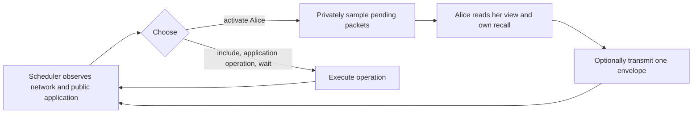

# The message runtime, its service schedule, and compilation

## 1. One activation, one optional message

The reactive protocol separates four components:

1. **The network** stores pending messages and includes them in a ledger.
2. **The application** checks included messages and executes its own public
   operations, such as chance and timeout.
3. **The scheduler** chooses the next interaction: activate a player,
   include, perform an application operation, or wait.
4. **The observation rule** privately samples a subset of other authors'
   pending packets when a player is activated.

When activated, a player chooses at most one transmission.
Control then returns to the scheduler. The scheduler sees the actual network
output before choosing what happens next. It may activate that player again.
Sampling, computing a response, and constructing commitment material happen
inside the player's action; they consume no separate turns or clock time.
Private implementation memory is part of the strategy, not a response field
or an additional canonical game action.



The scheduler is a fixed policy of the player game. It may adapt and randomize;
replacing Alice's strategy keeps its policy fixed, while allowing its decisions
to change in response to her traffic. It has no strategic utility coordinate.

The core definitions are in
[ReactiveApplication.lean](../Interaction/ReactiveApplication.lean) and
[ReactiveProtocol.lean](../Interaction/ReactiveProtocol.lean). They do not depend
on Vegas, its source syntax, or its event graph.

## 2. What the network stores

An envelope contains its author's identity, an author-local serial number, and
a payload. The network stores pending envelopes, the shared ledger, each
player's private leaked-message knowledge, an input history of **broadcaster
and envelope** pairs, and the
next serial number for each author.

The input history is the network's record of what it received. It distinguishes
Alice authoring a packet from Bob rebroadcasting that same packet. It contains
no private player memory or private opening material.

| Operation | Effect |
|---|---|
| Submit | Allocate a fresh author-local identifier; append the envelope to pending and a broadcaster/envelope pair to the input history. |
| Replay | Append a known envelope unchanged, recording the current broadcaster separately. |
| Privately observe at activation | Learn selected, previously unknown pending envelopes from other authors. Leave them pending; give the scheduler no observation or receipt. |
| Include | Remove one pending copy, append it to the ledger, and call the application handler. |
| Wait | Make no message change. |

Missing identifiers, own packets, and repeated observations add no knowledge.
Reordering, replay, and selective inclusion are possible. A pending envelope
is not automatically learned or eventually included. Inclusion publishes the envelope even if the
application rejects it, and records a public acceptance/rejection receipt.
Consequently, a rejected opening may still reveal its raw value.

Fresh submissions are authenticated by construction: an activation of Alice
can author a new envelope only as Alice. Replay retains the original author.
Signatures, fees, blocks, reorganizations, and physical network latency are
outside this ideal message machine. See
[MessageNetwork.lean](../Interaction/MessageNetwork.lean).

## 3. What each participant knows

A player sees its accumulated leaked packets, the ledger, public receipts, and the application's
authorized local projection. It also remembers each of its previous views,
chosen semantic actions and actual emitted envelopes. This includes
the identifiers allocated to its own submissions.

There is no separate player-facing sent list. At every legal initialized
history, the network inputs attributed to a player are exactly the emitted
envelopes in that player's recall. The checked law in
[ReactiveRecall.lean](../Interaction/ReactiveRecall.lean) establishes that replay
eligibility can be reconstructed from own recall, leaked packets, and ledger.

Stateful implementations may retain arbitrary private computation state.
[ReactiveImplementation.lean](../Interaction/ReactiveImplementation.lean)
realizes them as behavioral policies using their own observation/action
transcripts, and proves equality of the entire execution law against arbitrary
opponents and scheduling. The implementation's memory representation does not
enter game histories or enlarge action menus.

The [finite semantic instance](finite-reactive-responses.md) also removes
unavailable replay attempts and ineffective private opening annotations from
its legal actions. Checked normalization preserves the exact public packet and
one-step operational effect. The instance retains every packet form within
explicit value and handle bounds, including malformed signaling, and all known
replays. Relating these bounds to a concrete blockchain encoding remains an
obligation; a one-step normalization proof is not an equilibrium quotient theorem.

The scheduler sees pending packets, the ledger, network inputs, the public application projection,
receipts, and its own command recall. It can inspect pending packet contents
and their broadcasters. It cannot inspect private leak results, players' recall,
hidden commitment meanings, or private initial inputs. Scheduler history
records its own commands and public pre-states; it carries no record of who
learned which packet. A player learns pending packet contents through passive
observation or inclusion; it cannot inspect the entire pool.

[Passive eavesdropping](passive-eavesdropping.md) specifies the observation
contract and checked visibility laws. The scheduler can infer information from
subsequent public responses or a known observation rule; hiding the private
samples does not require a forgetful inclusion policy.

## 4. Repeated activations and messages in transit

For example, the scheduler can choose:

```text
activate Alice       Alice submits packet x
activate Bob         The private observation rule may reveal x; Bob replies y
activate Alice       Alice gets another opportunity to act
```

Neither packet needs to have been included. The scheduler can choose the final
activation based on the actual reply. Alice's private observation at her next
activation may reveal y. The scheduler does not select or observe that sample.

[ReactiveProtocol.lean](../InteractionTests/ReactiveProtocol.lean) checks the
first two activations through the canonical randomized protocol runner, then
checks that Bob's response determines the scheduler's next activation. Both
packets remain pending. It also checks that replay preserves the author while
recording the new broadcaster. A partial-observation instance checks that both
learning and missing a packet are possible with identical scheduler views and
recall. Own packets are excluded even when selected by the observation rule.

An optional single message and an atomic list of messages give different
scheduling rights. A list prevents intervention between its elements. Here
each transmission returns control to the scheduler. Multiple transmissions
are obtained through multiple activations, with no batch length or player
response capacity to infer.

## 5. The Vegas application

Vegas uses a finite typed event graph. Every event has a stable address,
prerequisites, and an output field. Binding and resolution events also have an
owner and deadline; sample events draw a public result. An event completes at
most once and only after its prerequisites.

The packet forms are commitment, opening, withholding, and malformed data.
The application checks addresses, readiness, deadlines, authorization, and
commitment conditions. Inclusion can reject a packet without completing an
event. A verified opening can fail a guard and complete with public failure;
expiry can also complete an unresolved strategic event with failure.

A commitment submission supplies a public handle and optional **private**
opening material in the same action. A fresh owned handle gets its immutable
meaning before the envelope enters pending. Missing material fixes that handle
as unopenable. Its meaning cannot be supplied or changed later. Candidate
serials are handle identifiers, not allotted computation or preparation turns.

A player can submit a fresh candidate later, including after reading a
message. Earlier candidates and packets remain intact and can still be
selected for inclusion. A new submission does not replace pending traffic.

[ReactiveRuntime.lean](../Vegas/Pending/ReactiveRuntime.lean) supplies the
application instance and direct binding construction. Its observation theorem
shows that the network sees the same handle packet for any private value or
unopenable meaning. [ReactiveSafety.lean](../Vegas/Pending/ReactiveSafety.lean)
proves that every supported canonical transition preserves fixed meanings,
under arbitrary player actions and scheduler choices.

## 6. Service is a separate contract

The base protocol places no fairness requirement on the scheduler. Its finite
horizon counts scheduler decisions. An activation consumes one such decision;
the player response always runs, including after the last allowed activation.
This bounds the protocol by twice the horizon plus one setup step. It does
not guarantee application completion.

**The interaction bound is a substantive restriction relative to an unrestricted
blockchain network.** Contract timeouts and finite block or transaction sizes
do not alone bound every pre-inclusion transmission, observation or reaction.
The model assumes an explicit finite number of scheduler opportunities. A
backend must justify that bound through additional admission and progress
assumptions. It limits strategic opportunities, so truncation is not merely a
proof-evaluation convenience. The distinction from evaluation fuel and the
unproved unbounded case are documented in the
[sequential-equilibrium design](sequential-equilibrium-design.md).

The concrete scheduler in
[ReactiveService.lean](../Vegas/Pending/ReactiveService.lean) repeats visits in a
chosen event order. A strategic visit is:

```text
grant event
activate its owner once
allow a configured number of network choices
include the latest pending owner-authored packet for this event, if any
execute the event if it is a sample
```

At each network choice, the network policy may activate **any** player,
include, or wait. There is no reaction roster. After visiting all
events, the service advances the logical clock and checks expiry. Player
activations do not advance that clock.

This is one concrete scheduler instance, with a fixed event order and a finite
interaction budget. The general protocol allows other scheduler policies.
Completion is checked for this instance under arbitrary player policies and
adaptive network choices. If the graph has `n` events and maximum deadline
`d`, then `n * (d + 1)` epochs suffice. This includes runs where players wait,
send malformed traffic, replay packets, or make competing submissions.

The proof has three parts:

1. [ReactiveServiceEvaluation.lean](../Vegas/Pending/ReactiveServiceEvaluation.lean)
   proves that the concrete scheduler follows the epoch plan in canonical
   behavioral play. A network-selected activation consumes one service
   instruction, and its player response always runs.
2. [ReactiveServiceProgress.lean](../Vegas/Pending/ReactiveServiceProgress.lean)
   proves that completed events persist, each epoch advances time once, and
   unfinished events retain their activation timestamps.
3. [ReactiveServiceCompletion.lean](../Vegas/Pending/ReactiveServiceCompletion.lean)
   proves that ready chance events are sampled and due strategic events expire.
   Each deadline window therefore completes a ready event, until none remain.

The shared [completion contract](../Vegas/Pending/CompletionService.lean) applies
to both the reactive service and the command service. It concerns completion;
preserving the compiler's intended outcome additionally requires packet
protection and the compiler correspondence laws.

## 7. How a source policy compiles

The source compiler builds the typed graph, with dependency barriers selected
by the execution mode. At a ready owned grant, the reactive policy:

1. Reconstructs its graph observation and normalizes event-order metadata.
   Bindings use the value that took effect; disclosure intentions can be
   restored from validated private recall of the accepted packet.
2. Samples its graph policy once.
3. Remembers that intention and submits the corresponding commitment, opening,
   or withholding packet in the same action.

On consistent own histories, it waits after sending an event's packet.
After an earlier unsupported response, it uses a
[recovery continuation](reactive-recovery.md): reuse a supported remembered
choice or sample the source policy, then submit again. A binding retry uses a
fresh handle; old meanings and deadlines remain fixed. Private recall retains
distinctions that public failure erases, such as an intended opening whose
guard fails.

[ReactiveFreshCandidates.lean](../Vegas/Pending/ReactiveFreshCandidates.lean)
proves that every legal initialized reactive history leaves fresh handles
available, under arbitrary schedulers and deviations. The compiler's
allocation branch therefore cannot fail because of exhausted candidates.
This does not guarantee that the selected packet wins inclusion.

[ReactivePacketIntegrity.lean](../Vegas/Pending/ReactivePacketIntegrity.lean)
proves that a player following its compiled policy from initialization emits
at most one packet for each event, under arbitrary repeated activations.
Completing the policy with recovery preserves its initialized state law.
Every retained network envelope has an actual
submission in its author's recall, by
[ReactiveProvenance.lean](../Interaction/ReactiveProvenance.lean). Together these
facts ensure that every retained packet under that author and event equals the
player's remembered output. Other players may read it and replay it, including
before inclusion, but cannot substitute a different envelope.

This guarantee is playerwise: opponents may use arbitrary policies, and the
scheduler may choose any commands. It holds at every supported prefix of
canonical play when the focal player follows its compiled policy from setup.
Provenance alone holds at every legal initialized history, including arbitrary
deviations. Packet identity does not establish that the application accepts
the packet or that the reserved service realizes the intended source decision.

The graph policy is in [ReactivePolicy.lean](../Vegas/Pending/ReactivePolicy.lean);
the source composition and private initial law are in
[ReactiveCompilation.lean](../Vegas/Game/ReactiveCompilation.lean).

## 8. What is proved

| Claim | Status |
|---|---|
| Canonical reactive protocol, information-local menus, termination and horizon bound | Checked |
| Raw policies correspond exactly to canonical behavioral policies | Checked, playerwise in both directions |
| State evaluator agrees with the canonical randomized history runner | Checked |
| Own broadcast recall suffices for replay knowledge | Checked at every legal initialized history |
| Every retained envelope originates in an actual submission by its author | Checked at every legal initialized history |
| Private binding construction, hiding, and retention of fixed meanings | Checked |
| Complete finite response syntax under explicit value/handle bounds, including errors and known replays | Checked; concrete backend encoding and compiler range coverage open |
| Ineffective-response normalization preserves exact packets and one-step operational effects | Checked; raw-action recall and equilibrium equivalence outside this result |
| Compiler and recovery responses are normal forms | Checked at every input |
| Passive observation, reply, and adaptive reactivation before inclusion | Checked regression |
| Own packets never enter passive knowledge | Checked at every legal initialized history |
| Private leak outcomes are absent from scheduler view and recall | Checked for arbitrary observation rules and schedulers |
| Fresh candidate availability after every legal initialized history | Checked |
| Source strategy compiler and concrete service scheduler | Defined |
| Compiler samples, remembers, and sends in one activation; repeated activation does not resample | Checked binding regression |
| Compiled player emits at most one packet per event; opponents cannot replace it under that author/event | Checked at every canonical prefix, with arbitrary opponents and scheduler |
| Reserved epoch service follows its schedule and completes under arbitrary policies | Checked through canonical behavioral play; this does not cover arbitrary uniform calendars |
| Packet acceptance, protection through reserved inclusion, and full compiler outcome/deviation laws | Open |
| SPE preservation for unrestricted reactive scheduling | Refuted by a checked public-traffic scheduler |
| SPE preservation by the current recovery compiler under uniform inclusion and at-most-once publication alone | Refuted by a checked honest-source counterexample |
| SPE preservation under a stronger reactive service contract | Open |
| Original-submission authorization and permanent exclusion under its acceptance contract | Checked; enforced by the public-history monitor and authorized uniform calendar; ledger certificates open |
| Authorized uniform inclusion retains local response regularity | Checked at every legal prefix, for all raw responses |
| Early-opening witness under the authorized calendar | Proper root and full compared continuations checked: compiler 5/2, exhibited deviation 2; full SPE open |
| Authorization confines a player's unfinished owned packets to its ready event, including with concurrent foreign events | Checked under the source graph's information discipline |

The [obstruction inventory](spe-obstructions.md) separates these native negative
results from local witnesses and the remaining positive proof obligations. The
[combined service design](reactive-spe-service.md) records how authorization,
selection, timing, observations, and recovery must fit together.

A reactive SPE argument must use the private observation rule and actual
canonical information sets. Scheduler-controlled self-delivery and inclusion
conditioned on a private leak record are outside this model. The
[reactive inclusion counterexample](reactive-inclusion-obstruction.md) uses
valid competing commitments and public scheduling, with a checked proper root
and arbitrary randomized continuation bounds. Its scheduler is a standalone
instance of the generic interface, not the reserved epoch scheduler.

The paper's existing Nash/Bayesian theorem uses the command-service target,
whose prescribed policy takes three owner calls to remember, prepare, and send.
That theorem remains scoped to that target. Its service proof cannot be reused
as a theorem about this reactive game without a new correspondence proof.

The fixed-service coalescing modules retain mathematical comparisons of action
boundaries; they are not the reactive scheduling interface. Their endpoint
laws and SPE counterexamples retain their stated hypotheses. See
[Action boundaries and subgame perfection](action-coalescing.md).
