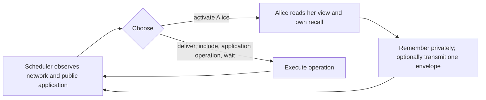

# The message runtime, its service schedule, and compilation

## 1. One activation, one optional message

The reactive protocol has three components:

1. **The network** stores messages, delivers them, and includes them in a ledger.
2. **The application** checks included messages and executes its own public
   operations, such as chance and timeout.
3. **The scheduler** chooses the next interaction: activate a player, deliver,
   include, perform an application operation, or wait.

When activated, a player chooses private memory and at most one transmission.
Control then returns to the scheduler. The scheduler sees the actual network
output before choosing what happens next. It may activate that player again.
Sampling, computing a response, and constructing commitment material happen
inside the player's action; they consume no separate turns or clock time.



The scheduler is a fixed policy of the player game. It may adapt and randomize;
replacing Alice's strategy keeps its policy fixed, while allowing its decisions
to change in response to her traffic. It has no strategic utility coordinate.

The core definitions are in
[ReactiveApplication.lean](../Interaction/ReactiveApplication.lean) and
[ReactiveProtocol.lean](../Interaction/ReactiveProtocol.lean). They do not depend
on Vegas, its source syntax, or its event graph.

## 2. What the network stores

An envelope contains its author's identity, an author-local serial number, and
a payload. The network stores pending envelopes, the shared ledger, each
player's inbox, an input history of **broadcaster and envelope** pairs, and the
next serial number for each author.

The input history is the network's record of what it received. It distinguishes
Alice authoring a packet from Bob rebroadcasting that same packet. It contains
no private player memory or private opening material.

| Operation | Effect |
|---|---|
| Submit | Allocate a fresh author-local identifier; append the envelope to pending and a broadcaster/envelope pair to the input history. |
| Replay | Append a known envelope unchanged, recording the current broadcaster separately. |
| Deliver | Copy a pending envelope to one player's inbox. Leave it pending. |
| Include | Remove one pending copy, append it to the ledger, and call the application handler. |
| Wait | Make no message change. |

Missing identifiers have no effect. Repeated delivery, reordering, replay,
and selective inclusion are possible. A pending envelope is not automatically
delivered or eventually included. Inclusion publishes the envelope even if the
application rejects it, and records a public acceptance/rejection receipt.
Consequently, a rejected opening may still reveal its raw value.

Fresh submissions are authenticated by construction: an activation of Alice
can author a new envelope only as Alice. Replay retains the original author.
Signatures, fees, blocks, reorganizations, and physical network latency are
outside this ideal message machine. See
[MessageNetwork.lean](../Interaction/MessageNetwork.lean).

## 3. What each participant knows

A player sees its inbox, the ledger, public receipts, and the application's
authorized local projection. It also remembers each of its previous views,
chosen actions, private memory, and actual emitted envelopes. This includes
the identifiers allocated to its own submissions.

There is no separate player-facing sent list. At every legal initialized
history, the network inputs attributed to a player are exactly the emitted
envelopes in that player's recall. The checked law in
[ReactiveRecall.lean](../Interaction/ReactiveRecall.lean) establishes that replay
eligibility can be reconstructed from own recall, inbox, and ledger.

The scheduler sees the complete network, public application projection,
receipts, and its own command recall. It can inspect pending packet contents
and their broadcasters. It cannot inspect players' private recall, hidden
commitment meanings, or private initial inputs. A player learns pending packet
contents through delivery or inclusion; it cannot inspect the entire pool.

## 4. Repeated activations and messages in transit

For example, the scheduler can choose:

```text
activate Alice       Alice submits packet x
deliver x to Bob
activate Bob         Bob reads x and submits reply y
activate Alice       Alice gets another opportunity to act
```

Neither packet needs to have been included. The scheduler can choose the final
activation based on the actual reply. To let Alice read that reply before
acting, it can first deliver y to her. These are distinct network choices.

[ReactiveProtocol.lean](../InteractionTests/ReactiveProtocol.lean) checks the
first three choices through the canonical randomized protocol runner, then
checks that Bob's response determines the scheduler's next activation. Both
packets remain pending. It also checks that replay preserves the author while
recording the new broadcaster.

An optional single message and an atomic list of messages give different
scheduling rights. A list prevents intervention between its elements. Here
each transmission returns control to the scheduler. Multiple transmissions
are obtained through multiple activations, with no batch length or player
response capacity to infer.

## 5. The Vegas application

Vegas uses a finite typed event graph. Every event has a stable address,
prerequisites, and an output field. Binding and resolution events also have an
owner and deadline; sample events draw a public result. An event completes at
most once and only after its prerequisites.

The packet forms are commitment, opening, withholding, and malformed data.
The application checks addresses, readiness, deadlines, authorization, and
commitment conditions. Inclusion can reject a packet without completing an
event. A verified opening can fail a guard and complete with public failure;
expiry can also complete an unresolved strategic event with failure.

A commitment submission supplies a public handle and optional **private**
opening material in the same action. A fresh owned handle gets its immutable
meaning before the envelope enters pending. Missing material fixes that handle
as unopenable. Its meaning cannot be supplied or changed later. Candidate
serials are handle identifiers, not allotted computation or preparation turns.

A player can submit a fresh candidate later, including after reading a
message. Earlier candidates and packets remain intact and can still be
selected for inclusion. A new submission does not replace pending traffic.

[ReactiveRuntime.lean](../Vegas/Pending/ReactiveRuntime.lean) supplies the
application instance and direct binding construction. Its observation theorem
shows that the network sees the same handle packet for any private value or
unopenable meaning. [ReactiveSafety.lean](../Vegas/Pending/ReactiveSafety.lean)
proves that every supported canonical transition preserves fixed meanings,
under arbitrary player actions and scheduler choices.

## 6. Service is a separate contract

The base protocol places no fairness requirement on the scheduler. Its finite
horizon counts scheduler decisions. An activation consumes one such decision;
the player response always runs, including after the last allowed activation.
This bounds the protocol by twice the horizon plus one setup step. It does
not guarantee application completion.

The concrete scheduler in
[ReactiveService.lean](../Vegas/Pending/ReactiveService.lean) repeats visits in a
chosen event order. A strategic visit is:

```text
grant event
activate its owner once
allow a configured number of network choices
include the latest pending owner-authored packet for this event, if any
execute the event if it is a sample
```

At each network choice, the network policy may activate **any** player,
deliver, include, or wait. There is no reaction roster. After visiting all
events, the service advances the logical clock and checks expiry. Player
activations do not advance that clock.

This is one concrete scheduler instance, with a fixed event order and a finite
interaction budget. The general protocol allows other scheduler policies.
The protection and completion theorems for this instance remain open.

## 7. How a source policy compiles

The source compiler builds the typed graph, with dependency barriers selected
by the execution mode. At a ready owned grant, the reactive policy:

1. Reconstructs its graph observation, including original intended actions
   from private recall, and normalizes the event-order metadata.
2. Samples its graph policy once.
3. Remembers that intention and submits the corresponding commitment, opening,
   or withholding packet in the same action.

After sending an event's packet, it waits on further activations for that
event. Fresh handle selection uses the owner's candidate view. Private recall
retains distinctions that public failure erases, such as an intended opening
whose guard fails.

The graph policy is in [ReactivePolicy.lean](../Vegas/Pending/ReactivePolicy.lean);
the source composition and private initial law are in
[ReactiveCompilation.lean](../Vegas/Game/ReactiveCompilation.lean).

## 8. What is proved

| Claim | Status |
|---|---|
| Canonical reactive protocol, information-local menus, termination and horizon bound | Checked |
| Raw policies correspond exactly to canonical behavioral policies | Checked, playerwise in both directions |
| State evaluator agrees with the canonical randomized history runner | Checked |
| Own broadcast recall suffices for replay knowledge | Checked at every legal initialized history |
| Private binding construction, hiding, and retention of fixed meanings | Checked |
| Actual delivery, reply, and adaptive reactivation before inclusion | Checked regression |
| Source strategy compiler and concrete service scheduler | Defined |
| Compiler samples, remembers, and sends in one activation; repeated activation does not resample | Checked binding regression |
| Reactive service protection/completion and full compiler outcome/deviation laws | Open |
| Reactive SPE preservation or impossibility | Open |

The paper's existing Nash/Bayesian theorem uses the command-service target,
whose prescribed policy takes three owner calls to remember, prepare, and send.
That theorem remains scoped to that target. Its service proof cannot be reused
as a theorem about this reactive game without a new correspondence proof.

The fixed-service coalescing modules retain mathematical comparisons of action
boundaries; they are not the reactive scheduling interface. Their endpoint
laws and SPE counterexamples retain their stated hypotheses. See
[Action boundaries and subgame perfection](action-coalescing.md).
