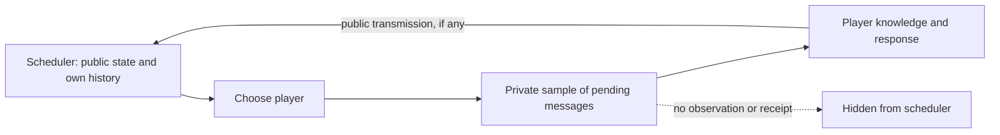

# Passive observation of messages in flight

## Contract

The message network models eavesdropping on other players' pending packets.
Observation is a private update to the observer's knowledge. The scheduler
receives no notification that a particular packet was learned.

At each activation:

1. The scheduler selects the player using public traffic, public application
   state, public receipts, and its own scheduling history.
2. A separate observation rule samples a finite set of message identifiers
   using the player identity and current pending packets.
3. The player learns selected packets that are pending, authored by someone
   else, and not already known. Own, missing, and duplicate identifiers add
   no observation. The sampled set itself is not shown to the player.
4. The player responds, optionally transmitting one packet.
5. The scheduler sees any resulting public traffic and chooses its next step.

Sampling occurs independently at each activation, conditional on the rule's
inputs. The observation rule has no mutable state or access to scheduler
recall. It may reveal a partial subset, all eligible packets, or none. Generic
runtime and service theorems quantify over this rule.

## State and visibility

The mathematical execution state contains each player's accumulated leaked
messages so that the player's next observation and replay permissions can be
computed. The scheduler's public projection omits this table. Its history
records scheduling commands and their public pre-state; neither exposes the
private samples or accumulated knowledge.

There is no scheduler command that sends a pending packet to a chosen reader.
Activation is the opportunity to eavesdrop. Repeated activations may provide
more information, but reading does not consume an additional network command,
change the logical application clock, or create a public receipt.

The scheduler retains its public-history memory, including packet inputs,
activation decisions, inclusion decisions, and public application operations.
A completely forgetful inclusion policy is a separate possible restriction.

## What independence means

At fixed public history and pending state, differing private leak outcomes
produce exactly the same scheduler view and recall. Every scheduler using this
interface therefore makes the same next-choice distribution at those states.

This does not prohibit every statistical correlation between observation and
inclusion. Both can depend on the pending traffic. A known observation rule
may reveal some packets with certainty. A player's later public response may
provide evidence about what they learned. The contract excludes access to the
private sample itself; it permits ordinary responses to public traffic.

## Checked properties

| Property | Artifact |
|---|---|
| Learning changes no public network state | [`MessageNetwork.learn_publicView`](../Interaction/MessageNetwork.lean) |
| Newly learned packets are foreign and actually pending | [`MessageNetwork.learn_mem`](../Interaction/MessageNetwork.lean) |
| All legal histories exclude own packets from passive knowledge | [`ReactiveApplication.history_foreignLeaks`](../Interaction/ReactiveKnowledge.lean) |
| All leak samples have the same complete scheduler observation and recall | [`ReactiveApplication.activation_visible_law`](../Interaction/ReactiveObservation.lean) |
| Arbitrary schedulers cannot distinguish samples through this interface | [`ReactiveApplication.scheduler_after_activation`](../Interaction/ReactiveObservation.lean) |
| Silent responses and private memory changes preserve that indistinguishability | [`ReactiveApplication.scheduler_after_silent_response`](../Interaction/ReactiveObservation.lean) |
| A player reads another player's pending packet and responds before inclusion | [`canonical_in_flight`](../InteractionTests/ReactiveProtocol.lean) |
| Both learning and missing a packet are possible while scheduling observations agree | [`partial_outcomes` and `partial_observation_hidden`](../InteractionTests/ReactiveProtocol.lean) |

Commitment meanings remain fixed at submission. The application invariants,
packet provenance, compiled-player packet uniqueness, service schedule
correspondence, and completion proofs cover arbitrary passive observation
rules as well as arbitrary player and scheduling policies.

## SPE boundary

SPE preservation for this reactive model is open. A counterexample must use
its actual information model, legal initialized histories, and a proper root
closed under every future decision information set. Returning an author's own
packet or conditioning inclusion on a private leak record cannot witness a
counterexample here.

A restricted continuation may still arise from competing valid submissions
and adaptive inclusion based on public traffic. Whether this obstructs SPE
under the intended action boundaries requires a separate argument. No SPE
preservation or impossibility theorem for passive eavesdropping is assumed.

The [inclusion investigation](inclusion-and-spe.md) isolates a positive local
condition and implements a uniform selector over distinct pending identifiers.
Its laws preserve passive observation and rebroadcasting. A generic theorem
transfers behavioral SPE through fixed lotteries over proper source roots;
the complete reactive compiler does not yet supply that certificate.
