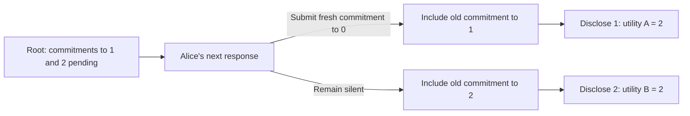

# A public inclusion rule that prevents SPE preservation

## Result and scope

There is a checked impossibility theorem for one concrete scheduler of the
reactive message protocol: no utility-independent translation of the example
source game preserves behavioral SPE for both of two public-result utilities.
This holds even for arbitrary whole-profile translations, and under either
source commitment-admission interface.

The example uses the actual reactive application and its canonical information
model. A response optionally submits one packet; its commitment meaning is
fixed at submission. There is one player, no passive leak, no delivery to the
sender, and no private preparation turn. Inclusion depends on public traffic.

The scheduler is permitted by the general reactive interface. It is a small
standalone service, **not an instance of the reserved epoch scheduler**. The
theorem therefore rules out preservation for unrestricted reactive scheduling.
It does not establish impossibility for every runtime or settle preservation
under a stronger inclusion contract.

## The source game

Alice binds an integer, then chooses whether to disclose it. Only the
disclosure result contributes to utility:

| Public result | Utility A | Utility B |
|---|---:|---:|
| 0 | 3 | 3 |
| 1 | 2 | 1 |
| 2 | 1 | 2 |
| Failure or any other integer | 0 | 0 |

The same source policy is SPE for both: bind `0`, and disclose after every
binding. Zero earns the maximum at a fresh binding. After any binding,
disclosure weakly dominates withholding. This also covers source semantics
that admit an unopenable commitment, since its disclosure cannot succeed.

## The target continuation, step by step

The graph has the corresponding binding and disclosure events. Start from an
empty network with the binding event granted. All steps below occur before
the deadline; no clock tick is needed.

| Step | Public effect |
|---|---|
| First activation | Alice submits envelope 0, committing to `1`. |
| Second activation | Alice submits envelope 1, committing to `2`. |
| **Subgame root** | Both commitments are pending and their meanings are fixed. |
| Third activation | Alice may submit a fresh envelope, replay, or remain silent. |
| Binding inclusion | Include envelope 0 if fresh envelope 2 is pending; otherwise include envelope 1. |
| Disclosure | Grant disclosure, activate Alice once, then include her latest disclosure packet, if any. |

The inclusion rule never chooses fresh envelope 2 for the binding event.
Even submitting a valid commitment to `0` cannot make `0` the accepted value.
It can, however, change which *older* commitment is included:

There is no random delivery in this construction. The scheduler is fixed and
deterministic. Its decisive inclusion choice reads the current public pending
pool; it does not read hidden commitment values, private observations, or past
traffic. Its position in the fixed schedule uses its command count.

The two earlier transmissions may be deviations from compiled play. SPE tests
proper subgames after such deviations too. The proof constructs this prefix
as a legal initialized history and establishes full subgame closure: Alice's
own recall identifies the first two responses at every future decision, so no
decision information set crosses the root.

## Why no common native SPE exists

From this root, every policy can publish only `1`, `2`, or failure. It may also
leave disclosure unfinished, which earns zero. This covers arbitrary packets,
replay and randomized behavior, including realized private implementations.
Binding immutability and the
disclosure check exclude a later publication of `0`.

Consequently, the two expected utilities sum to at most `3` for every
continuation policy. Yet each utility separately has a deviation earning `2`:

- For A, submit a fresh commitment to `0`, then disclose the selected value `1`.
- For B, remain silent, then disclose the selected value `2`.

Both deviations inspect only Alice's local information. A common native SPE
would therefore need expected utility at least `2` for each utility, giving a
sum at least `4`. Randomization cannot satisfy these inequalities.

A utility-independent translation must map the common source SPE to the same
native profile for both utilities. Since no such native profile is SPE for
both, that translation cannot preserve SPE. The contradiction does not need
an additional outcome-preservation premise. It also does not say that either
target game individually lacks an SPE: their optimal continuations differ.

## What this says about the design

**The issue is control over retained candidates.** The source policy says to
choose `0` while it is available, and to disclose after a value is fixed. It
does not supply a ranking of `1` against `2`. The target creates a continuation
where `0` is unavailable but Alice still controls the choice between `1` and
`2`. That new decision requires information about preferences that the source
policy does not encode.

**Binding and atomic responses hold throughout.** No commitment changes its
meaning, and the root does not cut between private preparation and submission.
It follows two separate public transmissions. Combining these and subsequent
responses into one strategic action would require a different game and its
own information and preservation argument. Atomic private computation alone
does not combine observable transmissions.

**Source forfeiture does not repair this example.** The two pending commitments
and the fresh commitment in the deviation are valid. The source common-SPE
proof covers both value-only and forfeiture-admitting interfaces. A flag for
malformed commitments cannot certify this scheduling obligation.

**Forgetting history alone is insufficient.** The decisive rule already uses
only current pending traffic. The [inclusion investigation](inclusion-and-spe.md)
instead requires that a fresh proposal compete with an unchanged distribution
over retained candidates, with a weight independent of the proposal. This
example violates that requirement: sending changes the selected old value
from `2` to `1`, while the fresh candidate has no chance of selection.

A positive service contract must constrain every inclusion that can settle
the event. Applying a uniform selector only at a final reserved step leaves
earlier adaptive acceptance unconstrained. The local selection and recovery
theorems are checked; their composition through the complete reactive service,
with passive partial leaks and reactions, remains open. No observation feature
has been removed to obtain this negative result.

## Checked artifacts

| Obligation | Artifact |
|---|---|
| Actual reactive scheduler, legal history, and full proper-root closure | [ReactivePendingMenus.lean](../VegasTests/ReactivePendingMenus.lean) |
| Immutable accepted fields under arbitrary reactive continuations | [ReactiveStore.lean](../Vegas/Pending/ReactiveStore.lean) |
| Bound for every randomized native policy, deviations, and no common SPE | [ReactivePendingMenusStrategies.lean](../VegasTests/ReactivePendingMenusStrategies.lean) |
| Source common SPE and agreement of source/graph publication kernels | [PendingMenusSource.lean](../VegasTests/PendingMenusSource.lean) |
| Impossibility of utility-independent source-to-reactive SPE translation | [ReactivePendingMenusSource.lean](../VegasTests/ReactivePendingMenusSource.lean) |

The application-level calculations reuse the two-value fixture. The reactive
legal history, subgame proof, policy laws, and SPE contradiction use the
reactive protocol itself.
