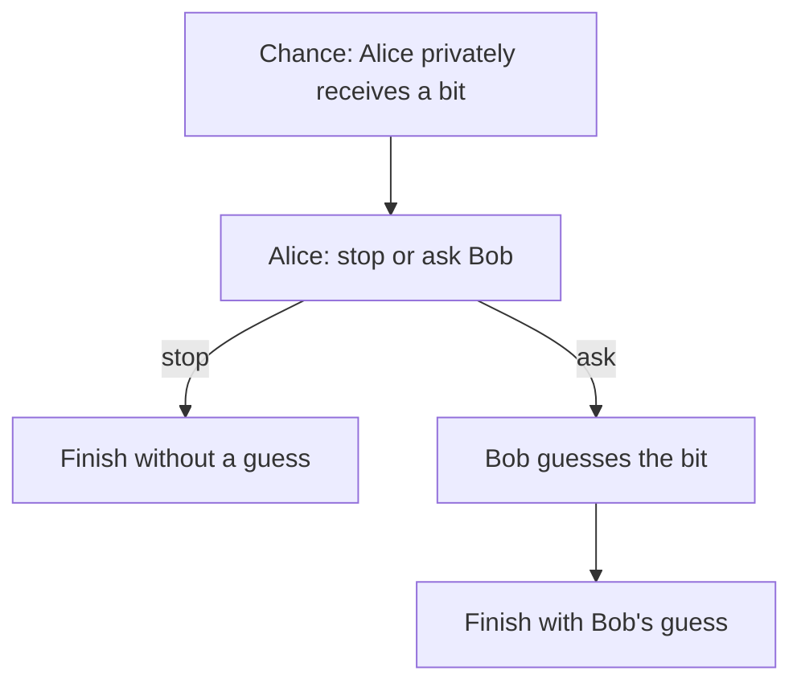

# The weakest semantic condition for SPE preservation

## Status

For **finite observed outcome spaces**, there is a checked necessary and
sufficient condition for a fixed source profile and a fixed target profile to
preserve behavioral SPE for every utility. It compares their continuation
incentive inequalities. Applying it to every source profile and its image
characterizes preservation by a fixed compiler.

This establishes a semantic boundary. It does not establish that the reactive
compiler satisfies the condition, or identify the weakest operational scheduler
contract. No assumption about mining, fees, or cryptography enters this theorem.
The separate initialized correctness requirement also remains necessary: SPE
preservation alone does not require the compiler to produce the intended result.

The implementation is in
[IncentiveCone.lean](../GameTheoryExtensions/Core/IncentiveCone.lean) and
[BehavioralIncentives.lean](../GameTheoryExtensions/Protocol/BehavioralIncentives.lean).
It uses the canonical proper subgames, whole behavioral replacements, and
bounded history runner. The GameTheory submodule is unchanged.

## Incentives, rather than separate outcome laws

Fix a profile, a player, a proper root, and an alternative policy for that
player. Write `P` for the observed outcome law when the player keeps the
profile's policy, and `Q` for the law after the replacement. The other players
keep their policies. The relevant incentive inequality is

\[
  \mathbb E_P[u] - \mathbb E_Q[u] \geq 0.
\]

For a finite outcome space, represent this comparison by its vector of signed
probabilities, `d = P − Q`. The inequality is `d · u ≥ 0`. Collect **all** such
source vectors for the same player, over all proper source roots and all
behavioral replacements. Source SPE says that all these inequalities hold,
for every player.

The exact preservation criterion is:

> Every target comparison vector belongs to the smallest closed convex cone
> containing the source comparison vectors for the same player.

Here a cone allows addition and multiplication by nonnegative real numbers;
its closure also contains limits of those combinations. The generator family
can be infinite even though outcomes are finite. No finite enumeration of
behavioral policies or native histories is assumed.

`behavioral_spe_preservation_iff_cone` proves both directions. For necessity,
one can vary one player's utility and set every other player's utility to zero.
`separating_utility` supplies an offending scalar utility when an individual
target comparison lies outside the source cone: every source comparison is
nonnegative, while that target deviation is strictly profitable.

The proof of `cone_le_iff` identifies the cone as the least closed convex cone
containing the generators, using the double-dual theorem. The characterization
is therefore more than a renaming of the universal-utility preservation claim.
It provides geometric certificates and separating counterexamples.

### A useful sufficient certificate

One can establish a particular target comparison by exhibiting

\[
  d_T = \sum_{j=1}^m a_j d_{S,j}, \qquad a_j \geq 0.
\]

`mem_cone_of_nonnegative_combination` checks this certificate. Coefficients do
not have to sum to one. The chosen source comparisons may depend on the target
root, player, and replacement. They must use the same fixed source profile and
player; the compiler and the certificate are fixed independently of utilities.
There is no requirement to match each baseline law or each deviated law
separately, or to use one root distribution for every replacement.

For example, compare certain success against certain failure in the source.
In the target, compare a fair success chance against certain failure. The target
incentive difference is half the source difference. Both comparisons require
the same ordering of success and failure, although the prescribed outcome laws
differ. [The checked regression](../GameTheoryExtensionsTests/IncentiveCone.lean)
proves incentive implication and the absence of a prescribed-law mixture over
the sole source comparison. This example concerns continuation comparisons;
it does not authorize changing initialized program outputs.

The existing exact-law and root-mixture transfer theorems remain useful
sufficient methods. Failure to find such a law correspondence is not by itself
an impossibility proof. Conversely, merely naming this cone condition does
not discharge a service's continuation obligations.

## Information after earlier deviations

The checked disclosure experiment isolates a gap that initialized unilateral
simulation cannot detect. It has two players, a private bit, and no network:

The source keeps the bit hidden from Bob. The target reveals it when Alice
asks. Actions, chance, and transitions otherwise coincide. The observed
analysis outcome retains the original bit and the public result. Alice's
utility is always zero. Consider two Bob utilities:

- **Match:** a correct guess earns 1; an incorrect guess or a stop earns 0.
- **Mismatch:** an incorrect guess earns 1; a correct guess or a stop earns 0.

The same prescribed source profile is SPE for both: Alice stops, and Bob
would guess false. There is no proper source subgame at Bob's decision,
because his information set crosses the two possible bits. The earlier
Alice histories also fail subgame closure because of those later Bob nodes.
Only initialization and terminal histories are proper roots. At initialization
Bob cannot change Alice's decision to stop, and Alice is indifferent.

In the target, each Bob history is a proper subgame: the disclosed bit
distinguishes the histories. At bit false, Match requires guessing false and
Mismatch requires guessing true. Randomization cannot satisfy both: their
expected payoffs sum to 1, but optimality for both would require each to be
at least 1. Thus no common target behavioral SPE exists. In particular no
utility-independent translation of this source profile can preserve SPE for
both utilities, even if it may inspect the whole source profile.

The example also has a playerwise compiler that makes Bob ignore the extra
information. It preserves the joint type/result law for **every** source
profile. Around the prescribed stop profile, **every target unilateral
deviation** has a source match with the same joint outcome law. The failure
only appears when Bob's incentives are evaluated after Alice has already
departed from her prescribed behavior.

The canonical histories and proper-root proofs are in
[OffPathDisclosure.lean](../GameTheoryExtensionsTests/OffPathDisclosure.lean).
The behavioral SPE impossibility is in
[OffPathDisclosureIncentives.lean](../GameTheoryExtensionsTests/OffPathDisclosureIncentives.lean);
the initialized laws are in
[OffPathDisclosureLaws.lean](../GameTheoryExtensionsTests/OffPathDisclosureLaws.lean).

### What this establishes about the runtime investigation

This is an **abstract information obstruction**, not a native counterexample
against the authorized uniform service. The target observation in the example
authenticates the actual bit. An arbitrary raw message claiming a bit does not
automatically do that: the same message might be sent with a different private
type. Such histories can still share an information set and prevent a proper
subgame. A native example must prove its information and root facts explicitly.

The example does establish that joint-law matching from initialization,
including all unilateral deviations around a source SPE, is insufficient.
Any positive reactive proof has to account for information and incentives
after earlier deviations by other players as well. A scheduler assumption
alone supplies no such information theorem.

It does **not** establish that all extra observations must be forbidden.
The cone criterion asks whether they create additional incentive constraints
unsupported by source SPE. This leaves room for harmless extra observations,
passive leaks, and different operational histories when their incentive
comparisons are already implied.

## How to use this boundary in the service design

Keep the [candidate service](reactive-spe-service.md) as a construction to
test. Binding, original-submission authorization, replay exclusion, selection
regularity, and calendar assumptions retain their separate meanings and proof
obligations. None has been shown individually necessary for all possible
SPE-preserving implementations.

For each proper native root and unilateral replacement, derive the comparison
vector of the **actual remaining execution**. Try to express it using source
comparisons, retaining original private types, prior deviations, pending
packets, remaining opportunities, and observation histories. Exact law matching
is one route; a nonnegative incentive certificate is another. If the cone test
fails, obtain the separating utility and inspect the native execution causing
the failure before strengthening the runtime contract.

This separates three tasks:

| Task | Evidence required | Status |
|---|---|---|
| Exact semantic implication, finite outcomes | Canonical SPE equivalence and cone characterization | Proved |
| Concrete service sufficiency | Coverage of every proper native root and replacement for the same compiler | Open |
| Operational or economic realism | Justification of the particular sufficient service assumptions and alternatives | To assess once sufficiency is established |

The theorem is not a decision procedure. It does not prove that the generated
cone has a computable finite presentation. Infinite outcome spaces also need
a separate formulation; the finite-outcome necessity theorem must not be
silently generalized to them.
