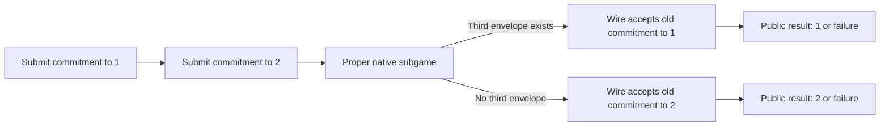

# Subgame perfection across compilation

## Status and recommendation

The [obstruction inventory](spe-obstructions.md) collects the concrete failure
mechanisms, distinguishes their proof scopes, and gives the combined proof plan.

The command-service compiler theorem concerns play from initialization. It preserves
Nash incentives, including ex ante Bayesian incentives for utilities of initial
parameters and public results. It does not establish subgame perfection.

The recommended target is preservation of behavioral subgame perfection by one
utility-independent, playerwise compiler, at every proper native subgame.
Reflection is a separate goal with a separate root-coverage obligation. Both
should use the canonical `GameTheory.Protocol.InformationModel` definitions.

Unrestricted reactive scheduling has a checked SPE impossibility. The
[public inclusion counterexample](reactive-inclusion-obstruction.md) uses
valid competing commitments, atomic responses, and a deterministic scheduler
that reacts to public traffic. Two utilities share a source SPE but have no
common native behavioral SPE. The proof includes a legal initialized history
and full proper-root closure in the reactive information model.

This is a standalone scheduler permitted by the generic reactive interface,
not the reserved epoch scheduler. Preservation under a stronger service
contract remains open. The [observation contract](passive-eavesdropping.md)
excludes self-delivery and keeps private observation samples out of scheduler
view and recall. Those exclusions hold in the counterexample, which needs no
leaks. Its decisive inclusion rule reads only current pending traffic, so
forgetting public history alone does not exclude it.

The [inclusion investigation](inclusion-and-spe.md) gives a checked positive
local condition: a fresh proposal weakly decreases each retained candidate's
selection probability, with selection independent of the fresh source value.
Uniform and positive weighted selection over distinct identifiers satisfy a
stronger fixed-mixture equation. Finite mixtures of stable priority rankings
satisfy the weaker regularity condition. All these selector laws are proved,
including invariance under replay of an already pending envelope. Their
economic motivations are documented separately from mathematical premises in
the [assumption note](inclusion-assumptions.md). A checked root-mixture transfer theorem
permits unresolved lotteries over proper source continuations. These components
do not yet instantiate the native SPE certificate.

Uniform selection and at-most-once inclusion also admit a
[checked failure of the current recovery compiler](early-opening-and-spe.md).
An honest source SPE has a profitable native deviation that spends an earlier
transmission on a later opening. This is a failure of whole-continuation
optimality even though the individual selection laws have the proposed local
properties. It does not establish impossibility for every compiler under
uniform selection. Dependency-authorized submission has a
[checked semantic exclusion rule](dependency-authorized-submission.md).
An enforcing backend and the positive SPE theorem remain open. The
[combined service design](reactive-spe-service.md) records the full contract
and the checked isolation of each player's authorized unfinished packets to
its current ready event, without globally serializing foreign commitments.

The [recovery compiler](reactive-recovery.md) completes prescribed play after
the owner's own deviations without adding runtime flags or private actions.
Its initialized canonical state laws and packet-uniqueness guarantees are
checked. Reusing a supported choice is also locally optimal under the inclusion
contract. Source-observation reconstruction and optimality throughout the
remaining reactive interaction still need the continuation proof.

The reactive protocol gives one optional message per activation. A separate
observation rule privately samples other authors' pending packets before the
response. Private computation and opening material require no separate turns.
Canonical information, bounded play, behavioral policy correspondence, and
evaluator correspondence are checked for arbitrary players, schedulers, and
observation rules. Reading and reacting before inclusion are retained.

The source policy compiler and a reserved-service scheduler are defined.
The scheduler follows its epoch plan and completes the graph under arbitrary
player policies, public scheduling decisions, and passive observations. Fresh
candidates remain available after every legal history. Packet uniqueness is
checked; acceptance, protection through inclusion, and full compiler
outcome/deviation correspondence remain open.

The fixed-service comparison protocol has a checked pending-menu impossibility:
two public utilities share a source SPE but have no common native behavioral
SPE. That theorem includes initialized reachability, proper-root closure,
information-local deviations, and arbitrary randomized continuation bounds.
Its witnessing root cuts consecutive owner invocations. Coalescing those
invocations removes that particular root. The
[action-boundary comparisons](action-coalescing.md) do not establish a reactive
SPE theorem.

Keep private inputs separate from commitments. Make commitment-failure
admission explicit in the source interface, and justify its omission separately
for each requested guarantee. The [preservation-contract design](preservation-contracts.md)
compares flag architectures and records executable and Lean experiments. A
request for SPE must not silently change the source game. A backend that only
satisfies the existing initial-play contract retains the existing Nash theorem;
it does not automatically satisfy the stronger contract.

There is a further obstruction independent of private preparation. The checked
atomic example below proves that adding early irreversible failure can prevent
any utility-independent compiler from preserving SPE from a value-only source.
An abstract withdrawal operation, a restricted continuation theorem, or a
runtime without that early commitment device is a substantive design choice.
Free private work alone does not resolve it.

### Checked implementation

The source protocol adapter is implemented for the actual typed program, with
an explicit commitment-admission map. It restricts legal transitions and
histories, retains the existing player views, and is equivalent to admitted
source pure and behavioral policies in both directions. Its initialized and residual laws
agree with the existing source runner; arbitrary legal prefixes retain private
state and own-action recall. A separate setup presentation includes the
private initial law as one chance step, using the same policies across draws.

[SourceSubgame.lean](../Vegas/Game/SourceSubgame.lean) and
[SetupSubgame.lean](../Vegas/Game/SetupSubgame.lean) identify canonical pure SPE
with inequalities over those source continuation laws. The tests in
[SourceProtocol.lean](../VegasTests/SourceProtocol.lean) and
[SetupProtocol.lean](../VegasTests/SetupProtocol.lean) prove that a hidden
forfeiture prefix and a hidden private-type draw, respectively, are not proper
subgame roots when another player's information set crosses them.

[Continuation.lean](../GameTheoryExtensions/Protocol/Continuation.lean) proves
the generic pure transfer theorem from prescribed and unilateral-mixture laws
at matching proper roots, plus a separate reflection theorem. The laws are
explicit hypotheses about one playerwise map. The canonical irreversible-
failure example refutes uniform certificates for that proposed abstraction in
[ContinuationTransfer.lean](../GameTheoryExtensionsTests/ContinuationTransfer.lean).
This code is in VegasCore; it requires no GameTheory submodule changes.

[BehavioralSubgame.lean](../Vegas/Game/BehavioralSubgame.lean) characterizes
behavioral SPE by the same source continuation laws, with arbitrary admitted
behavioral replacements. [BehavioralContinuation.lean](../GameTheoryExtensions/Protocol/BehavioralContinuation.lean)
proves conditional preservation and reflection for these policies. Its roots
are the existing information-set-closed histories, and its payoff uses the
existing randomized runner. The certified evaluation bound does not affect
the predicate. No finite player universe or finite action domain is assumed.

[NativeProtocol.lean](../Vegas/Pending/NativeProtocol.lean) presents native
service with the actual players as strategic coordinates. One player action
records private memory and optionally transmits a packet. Commitment submissions
carry private opening data; only the packet enters the network. There are no
preparation actions or intermediate positions. The service retains all three
initial owner invocations and every wire/roster reaction slot.

[NativeProtocolPolicy.lean](../Vegas/Pending/NativeProtocolPolicy.lean) proves
an equivalence with all native behavioral policies, using exactly own recall
and the native view. Every decision contributes one recall entry. Private memory
has no application effect, and the view exposes neither the service cursor nor
an application scratch cache. [NativeProtocolSafety.lean](../Vegas/Pending/NativeProtocolSafety.lean)
proves that this cache stays empty at every legal initialized history. It also
checks termination, fixed commitment meanings, live activation times, and fresh
handle availability. [EventBindingAction.lean](../Vegas/Pending/EventBindingAction.lean)
constructs any binding result in one action and proves exact graph acceptance
when the packet is included while ready and timely.

The internal expansion into message-machine operations supplies safety proofs;
it is not a strategic equivalence with a game containing preparation decisions.
The paper's initial-play capstones concern the command-service compiler.
The reactive graph/source policy compiler is defined; its full correctness
remains open. Positive continuation
and proper-root coverage need a scope that excludes the checked obstruction.
No positive native SPE capstone is claimed.

## What the theorem must mean

`GameTheory/Protocol/SubgamePerfect.lean` already defines:

- `InformationModel.IsSubgameRoot`: every decision information set intersecting
  the continuation lies wholly inside it.
- `InformationModel.IsSubgamePerfect`: no whole replacement policy improves a
  player's continuation value at any such root, including roots off the
  equilibrium path.
- `InformationModel.IsHistorywiseOptimal`: the stronger comparison after every
  complete history, whether or not it starts a proper subgame.

The existing SPE predicate takes pure, information-local policies, allows
probabilistic transitions, and uses `historyBackwardValue`. The EFG interface
specializes that predicate; it does not supply a different semantics.
Its one-shot characterization concerns the stronger historywise predicate
under its stated hypotheses. Do not substitute that characterization for SPE
in an imperfect-information game.

The desired statement is schematically

```text
Source.SPE u sigma -> Native.SPE (u o decode) (compile sigma).
```

Here `compile sigma` is one global contingent profile. Choosing a different
optimal native continuation separately at each root is not enough: those
choices must come from that same information-local profile. A deviation changes
future decisions; it never rewrites the prefix being evaluated.

Utilities remain `u : Theta × Omega -> Player -> Real`, with `Theta` read from
the original setup and `Omega` the public result. Continuation execution retains
the original types, private memories, packets, clock, and remaining service
cursor. It does not sample a new prior or restart the service budget.

Proper roots matter. Private types can prevent a history from starting a
subgame because an information set crosses its boundary. A public transcript,
a completed event, or a complete machine state is not by itself a subgame-root
certificate. Checking only source-aligned checkpoints also leaves a weaker
property than native SPE. SPE need not rule out every implausible threat inside
an imperfect-information subgame; sequential equilibrium is a separate notion.

## Evidence that constrains the design

### A recoverable native prefix

[`VegasTests/ContinuationRecovery.lean`](../VegasTests/ContinuationRecovery.lean)
uses the real pending application and compiled player policy. There is one
player, one initial Boolean binding, and one resolve event with deadline two.
It checks:

1. A commitment packet addressed to the resolve event is rejected by `handle`.
2. Submitting that packet is a legal player step.
3. The compiled policy subsequently returns `wait`.
4. A correct opening at the same application state would publish successfully.

`compilePlayerPolicy` treats any earlier event-addressed submission as a reason
to stop submitting, independently of whether it can succeed. The first of the
three reserved owner calls can therefore leave a prefix from which following
the compiled policy wastes the remaining opportunities.

The checked result is operational: it does not yet prove the complete suffix
payoffs or that this prefix is a proper root of the full serviced game. Those
are the first adapter validation obligations. The repair must also account for
first-write remembered actions and occupied preparation slots after arbitrary
earlier commands; replacing one Boolean test is insufficient evidence of
general recovery.

### An optimal plan does not specify the best remaining choice

Suppose a one-player source decision offers `a`, `b`, and `c`, but a native
continuation offers only `b` and `c`:

| Utility | a | b | c |
| --- | ---: | ---: | ---: |
| `utilityB` | 3 | 2 | 1 |
| `utilityC` | 3 | 1 | 2 |

The same source plan chooses `a` optimally for both utilities. At the restricted
continuation the utilities require different choices. Randomization does not
help: the two expected utilities always sum to three, whereas optimality for
both would require each to be at least two.

[`GameTheoryExtensionsTests/ContinuationMenus.lean`](../GameTheoryExtensionsTests/ContinuationMenus.lean)
checks this using the canonical `GameForm` and `IsεNash`, including the explicit
nonexistence of a utility-independent completion function for this plan and
menu. It is an abstract continuation obstruction, not a theorem that every
Vegas implementation has such a continuation.

The direct-action native game has no preparation-capacity obstruction.
Every finite prefix leaves fresh handles, and one action can submit any value. The checked construction does not assume an empty cache or
an unused canonical event slot. An existing transmitted candidate remains
binding, and an earlier pending packet can still win inclusion; the two cases
are checked in `VegasTests/InFlightCommitment.lean`. A continuation certificate
must address these remaining network choices. It cannot treat a new submission
as cancellation of the old one.

### A restricted menu in a proper native subgame

[PendingMenus.lean](../VegasTests/PendingMenus.lean) uses the actual native
protocol, with one player, an integer binding, and its public disclosure.
Deadlines are two, the event order is fixed, and one wire opportunity follows
the three initial owner invocations. The reaction roster is empty; this is an
allowed service instance, not an alteration to the protocol.

The first two owner actions submit valid commitments to `1` and `2`. Consider
the history just before the third owner action. A fixed public wire policy
includes the first envelope if an envelope with the next sender-local id
exists, and the second otherwise. It inspects traffic, not hidden values.
The player can select `1` by submitting another packet and `2` by waiting.
Even a valid fresh commitment to `0` cannot win this inclusion.



The proof covers every third action: private memory, replay, arbitrary opening
data, malformed packets, and cross-event submissions. It then covers every
later finite native trace. These traces cannot publish `0`; the selected
binding is immutable and a successful disclosure must match it. Intermediate
endpoints may still have an unfinished publication.

This prefix is a proper root under the canonical information-set closure
definition. The deterministic service fixes the prefix before the first two
actions, and the player's recall identifies those actions at every subsequent
decision. Equal decision information therefore cannot cross the root.

For the numerical obstruction, use public-result utilities:

| Public result | Utility preferring 1 | Utility preferring 2 |
| --- | ---: | ---: |
| 0 | 3 | 3 |
| 1 | 2 | 1 |
| 2 | 1 | 2 |
| Failure | 0 | 0 |

Every law supported by the residual native paths has utility sum at most three.
Thus no randomized law has value at least two for both utilities.

[PendingMenusStrategies.lean](../VegasTests/PendingMenusStrategies.lean)
proves both deviation witnesses against the canonical randomized runner.
To obtain `1`, the player submits its correct future opening during the last
binding invocation; to obtain `2`, it waits. During the disclosure grant it
submits the appropriate opening. Reserved inclusion publishes the selected
value within ten service steps, before any clock tick. Every later service
step preserves that result. Each deviation therefore earns two for its
respective utility. SPE would require both lower bounds, contradicting the
sum bound. `VegasTests.PendingMenus.no_common_native_spe` quantifies over all
native behavioral policies, including private memory and randomization.

[PendingMenusSource.lean](../VegasTests/PendingMenusSource.lean) supplies the
actual source program and its common behavioral SPE: bind `0`, then always
open. At a fresh binding, zero attains the global maximum of three. After any
binding, opening weakly dominates withholding, including after forfeiture.
The proof covers both source admission interfaces. The source and example
graph publication kernels agree for every binding and disclosure.
`VegasTests.PendingMenus.no_utility_independent_spe_compiler` combines these
facts. The translation is fixed before choosing the utility; no outcome
simulation premise is needed for the contradiction.

**Design consequence.** Fresh handles and explicit source forfeiture address
different obligations from pending-packet selection. An SPE certificate must
account for service-created restricted menus. Do not treat source admission of
failure as a sufficient backend capability, silently cancel older packets, or
remove wire reactions to make a continuation correspondence hold. Keep these
requirements in the service/translation evidence; they do not justify exposing
message identifiers or packet pools in the abstract language.

## Protocol architecture

### Early irreversible failure is strategically observable

[`GameTheoryExtensionsTests/IrreversibleFailure.lean`](../GameTheoryExtensionsTests/IrreversibleFailure.lean)
uses the canonical `InformationModel.IsSubgamePerfect`, its history evaluator,
and its definition of proper subgames. One player takes four atomic decisions:
seal A, choose B, disclose A, disclose B. The source requires A to be openable;
the target additionally permits an unopenable A. All decision histories are
proper subgame roots, proved using the player's complete own-action recall.
There is no private preparation, clock, network, or computation cost.

The two utilities depend only on the public results:

| Public result | Utility favoring false after failure | Utility favoring true after failure |
| --- | ---: | ---: |
| A succeeds; B is either value | 3 | 3 |
| A fails; B is false | 2 | 1 |
| A fails; B is true | 1 | 2 |
| B is withheld | 0 | 0 |

The same source plan is SPE for both utilities: seal an openable A, choose
false for B, and disclose both. At every source continuation before A's
disclosure, success remains available and is preferable. If A was already
withheld, B's value has already been chosen; disclosing B is then optimal for
either utility.

The target has a proper subgame after an unopenable A is sealed but before B is
chosen. A's failure is now unavoidable. The two utilities require opposite B
choices. The module proves
`GameTheoryExtensionsTests.IrreversibleFailure.no_utility_independent_spe_compiler`:
no single translation of that common source plan is SPE for both utilities. A separate
finite-distribution bound proves that randomization cannot supply a common
optimal continuation either.

This explains the limit of the public-outcome abstraction. At initialization,
an unopenable binding can be simulated by a valid binding followed by deliberate
withholding. At an intermediate history, the valid binding still permits
disclosure; the unopenable one does not. Initial-law equivalence therefore does
not identify these continuation games.

The example is a complete SPE counterexample for the stated atomic protocols,
not a compiler theorem about the full Vegas runtime. Relating that protocol to
the source and serviced runtime still requires the adapters below. In
particular, an abstract withdrawal operation would address this obstruction
without exposing malformed values or candidate handles, but would not by itself
prove the remaining native continuation correspondence.

### One continuation semantics

The pure and behavioral continuation game forms in
[Continuation.lean](../GameTheoryExtensions/Protocol/Continuation.lean) and
[BehavioralContinuation.lean](../GameTheoryExtensions/Protocol/BehavioralContinuation.lean)
use the existing pure and randomized history runners. Behavioral SPE is Nash
optimality at each existing proper root. A proved bound on every legal history
ensures termination; a checked theorem makes the predicate independent of
which sufficient bound is supplied. Evaluation fuel is not a fresh operational
service budget.

Point-mass policies give exactly the existing pure run law. Behavioral SPE of
such a profile implies canonical pure SPE, because it includes all pure
replacements. No separate source evaluator or source-only root predicate is
introduced.

Value agreement for point-mass policies is not, alone, equivalence of pure and
behavioral SPE: the latter quantifies over behavioral deviations. Prove that
additional equivalence under an appropriate predraw/no-repeated-decision
condition, instantiated for these protocols. The current generic predraw
theorem's freshness premise covers all histories of different lengths, which
is stronger than merely having perfect recall or fresh genuine decision sites.
Do not make the adapters reveal an invisible service cursor to satisfy it.

[SingleMover.lean](../GameTheoryExtensions/Protocol/SingleMover.lean) constructs
behavioral joint actions when at most one player acts. Each player's marginal
is exactly its local policy law; idle players have singleton menus. This agrees
with the canonical finite product when a finite player instance is available.
The source and setup adapters supply the single-mover proof. Tests instantiate
the construction with natural numbers as players and a nondegenerate lottery
over a valid binding and forfeiture. No finite payload domain or equilibrium
existence assumption is needed for transfer.

### Source, graph, and native presentations

| Presentation | State and information | Required adequacy result |
| --- | --- | --- |
| Abstract source | Typed residual program, store, own-action recall, and explicit per-site commitment admission | Initial and residual laws agree with the selected source interface |
| Canonical graph | Existing configuration, event cursor, observations, and action histories | Residual laws agree with source suffix execution |
| Serviced native game | `NativeControl` and `NativeExecution`; actual own history and native view | Native policies correspond exactly to protocol policies; graph-policy compilation and source/native continuation laws remain required |

The source's legal actions must implement the selected admission interface:
values at a value-only site, values or forfeiture at an explicit failure site.
A subtype of complete strategies, by itself, does not select a tree of legal
histories. The failure-aware source can serve as the common internal interface,
but its initial public-outcome simulation does not license SPE failure elision.
That abstraction needs its own continuation certificate.

Reuse `SourceProgram.runFrom` and its typed successors, `CompiledSuffix`, and
the native service-control transitions. A protocol adapter exposes these
transitions to the shared game theory; it does not implement them again.
Prove policy correspondence on realizable decision views, in both directions
needed by the theorem, without increasing what a player observes.

The native protocol must have the actual players as strategic coordinates.
Setup, public chance, fixed wire policy, and fixed order policy belong in the
transition kernel. The existing `serviceProtocol` has one analysis agent
controlling focal-player, wire, and order decisions for a predraw proof; the
scheduler protocol fixes the players and makes the scheduler strategic. The multiplayer native action adapter supplies the required strategic coordinates;
neither analysis protocol can substitute for it.

Keep an explicit termination certificate. Begin with sequential dependencies
and a canonical order. Prove any extension to concurrent event scheduling as a
separate continuation theorem: store-law confluence does not establish root or
information-set correspondence.

## The continuation certificate and proof

Write `L_S(sigma, h)` and `L_T(compile sigma, k)` for the laws of decoded terminal
`(theta, omega)` pairs, starting from source and target histories respectively.

For each source profile `sigma` and each proper target root `k`, the sufficient
certificate supplies a finite law `mu` over **proper source roots**, with:

```text
L_T(compile sigma, k)
  = E[h ~ mu] L_S(sigma, h)

For every player i and native replacement tau:
L_T((compile sigma)[i := tau], k)
  = E[h ~ mu] E[rho ~ Q(i, tau, h)] L_S(sigma[i := rho], h).
```

These equations are equalities of distributions; the expectations denote
finite mixture. A single matching source root is the point-mass case. The
behavioral root-mixture theorem is implemented as
`InformationModel.isBehavioralSubgamePerfect_of_root_mixture_laws` in
[BehavioralContinuation.lean](../GameTheoryExtensions/Protocol/BehavioralContinuation.lean).
Its native law and root-coverage premises still need to be discharged.

The quantifier order carries substantive requirements:

- `compile` is fixed globally, playerwise, and independent of utilities.
- `mu` is chosen before the native deviation, and is the same in both laws.
  Changing the reference root distribution with the deviation invalidates the
  averaging proof.
- Each `rho` is one legal, information-local source replacement for its whole
  continuation. It cannot inspect hidden chance subsequently drawn below `h`.
- The unchanged source opponents remain `sigma[-i]`. The target prefix may
  already contain deviations by several players; restricting prefix coverage
  to a single earlier deviator does not suffice.
- The laws preserve the initial parameters as well as public results. At a
  fixed prefix these parameters are retained, not resampled.
- Every proper target root of the declared action semantics is covered. A split
  protocol can have roots inside an uninterrupted response; a coalesced protocol
  has no such internal histories. No positive-probability-on-equilibrium-path
  premise is allowed.

The transfer proof is short once these obligations are met. Source SPE bounds
every `rho` at every root in `mu`. Average first over replacement policies and
then over roots, and rewrite the two laws. The same argument preserves a
per-subgame epsilon bound. This is stronger than an ex ante epsilon bound,
which cannot simply be conditioned on rare prefixes.

The checked pure single-root theorem is
`InformationModel.isSubgamePerfect_of_continuation_laws` in the VegasCore
extension module. Its proof uses the canonical continuation values and finite
expectation bounds. The behavioral theorem supports root mixtures by averaging
over the same continuation games. Composition must preserve the global compiler
and root coverage; compose the laws before claiming a tower theorem.

For **reflection**, realize every proper source root by suitable proper native
roots and lift its profitable source deviations with the requisite continuation
laws. Terminal-law reflection at initialization is insufficient. Only after
this second direction is proved can an SPE equivalence preserve the distinction
between a Nash profile sustained by noncredible threats and an SPE profile.

## Native design to validate

The preferred backend contract is: before an abstract action takes effect,
all its source choices remain implementable; after it takes effect, the
available choices match the corresponding source continuation. Administrative
operations must preserve this correspondence, including after earlier
malformed commands. This is an obligation to prove, not a definition that can
be satisfied by deleting inconvenient native histories.

[EventPlayerAction.lean](../Vegas/Pending/EventPlayerAction.lean) implements one
player action with private memory and an optional transmission. Policy
computation is unrestricted. Memory is retained in own recall and has no effect
on commitments, application state, transport, or other players' information.
The native view omits the application sampled-action cache, which remains empty
at all legal histories. Intended source choices must be reconstructed from the
compiler's own action records when public outcomes alone do not determine them.

A commitment submission supplies its public envelope and private opening data
in the same action. Submission records the meaning and enqueues the packet;
there is no preparation choice or scheduled intermediate state. The internal
expansion into existing machine operations proves safety, not equivalence of
the two strategic history trees. The graph-policy compiler still needs direct
actions and arbitrary-prefix continuation laws.

Submission remains separate from passive observation and inclusion. At an
activation, the player can privately learn foreign pending packets and then
submit another packet, replay a known packet, or send nothing.
The reserved reactive service permits each envelope identifier to be included
at most once, even when application handling rejects its call. A second
inclusion request waits; a fresh envelope can retry the same payload.
[`interaction_history_publishedOnce`](../Vegas/Pending/ReactiveServicePublication.lean)
establishes this at every legal initialized service history. The lower-level
carrier and custom schedulers remain general; the service theorem is the
boundary enforcing this guarantee.
[ReactiveProtocol.lean](../InteractionTests/ReactiveProtocol.lean) checks
reactions before inclusion and indistinguishable scheduler observations under
different private samples. The fixed-service comparison in
[InFlightCommitment.lean](../VegasTests/InFlightCommitment.lean) separately
checks its explicit wire deliveries and retained service slots.

### When a transmitted handle acquires its meaning

Commitment meanings are fixed by authenticated submission, before the packet
enters the observable pool. A prepared handle keeps its value; an unprepared
handle becomes permanently unopenable. A foreign reference cannot freeze
another player's private candidate. Delivery, inclusion, replay, and later
private commands cannot change a fixed meaning.

`EventGraphRuntime.submitted_commitment_binding` proves this invariant for
arbitrary finite native continuations, without honesty or inclusion premises.
[`VegasTests/InFlightCommitment.lean`](../VegasTests/InFlightCommitment.lean)
checks the following transitions in the command-service comparison model:

1. Alice submits an unprepared commitment handle.
2. Bob's packet is submitted; the wire delivers both packets to their respective
   observers while the ledger and receipts are still empty.
3. One information-local Alice policy reads Bob's bit from her inbox and tries
   to prepare her already-transmitted handle with that bit.
4. The original handle remains unopenable. Alice can instead prepare and send
   a new handle with the received bit while the original envelope is pending.

The example checks the native transitions and handler; it does not assert a
serviced-game equilibrium or a proper-subgame witness. Its policy does not take
the bit as an extra input: it reads the actual received packet.

Binding is established by submission. Reading and reacting to other pending
messages remains possible through the separate wire and player invocations.

Both the fixed-service pending-menu theorem and the
[reactive inclusion theorem](reactive-inclusion-obstruction.md) rule out
unrestricted continuation coverage for their specified services, using each
protocol's own proper roots. A positive native edge needs premises governing competing
packets, irreversible acceptance, adaptive wire reactions, and recovery after
earlier submissions. Direct action construction alone supplies none of these
strategic premises.

Do not reset deadlines on retry: that changes completion and strategic timing.
Do not add candidate pools or staging counters to the abstract language.
Irrevocable forfeiture can express the strategic effect of malformed binding
without exposing invalid payloads; its admission and information timing must
be explicit. If the intended runtime cannot meet the continuation contract,
report the unresolved obligation or proved obstruction with its exact scope.
The existing Nash result does not discharge an explicit request for SPE.

An alternative is utility-aware equilibrium completion on newly introduced
continuations. That is an analysis/synthesis operation with additional inputs
and existence obligations, rather than the current playerwise compiler. In
multiplayer imperfect-information games, independent local maximization does
not even construct a mutually consistent equilibrium. This alternative is not
the default design.

## Proof gates

1. **Select a feasible scope.** The fixed-service and reactive pending-menu
   impossibilities include native reachability, proper-root closure, randomized
   continuation bounds, native deviations, and a common source behavioral SPE.
   Unrestricted certificates for those services cannot exist. A positive result
   must state additional service or game premises, or a different preservation
   claim. The reactive witness respects passive observation and atomic responses;
   it does not refute every service with those features. Any further
   counterexample needs its own proper-root and continuation proofs.
2. **Close the semantic bridge.** Pure and behavioral source adapters,
   arbitrary-prefix laws, private setup, and the crossed-root tests are checked.
   The reactive adapter, canonical policy equivalence, and
   execution laws and service completion are checked. Prove packet protection,
   compiler correctness, and source/native continuation correspondence, including
   behavioral deviations.
3. **Prove the source-to-canonical edge.** Establish source suffix laws, policy
   restriction compatibility, and root coverage for histories legal under the
   selected commitment-admission interface. Keep concurrent scheduling outside
   this gate.
4. **Validate the native action contract.** The reactive protocol has checked
   submission binding, fresh candidate availability, and bounded play. Application
   completion is checked for the concrete reserved service under arbitrary policies.
   Discharge hostile prefixes for the selected compiler: establish recovery,
   candidate allocation, source-action recall, and residual choice correspondence.
5. **Compose preservation.** Instantiate the continuation certificate at every
   native root and lift joint parameter/public-result utilities. Add a genuine
   noncredible-threat example that is Nash but not SPE, alongside a preserved
   SPE. Prove reflection and scheduler generalization only with their additional
   coverage lemmas.

All five gates are required before adding native SPE preservation to the paper.
The source part of the semantic bridge and the conditional pure and behavioral
transfer and reflection theorems are checked. The remaining gates are not discharged by the examples,
and no missing theorem is asserted as an axiom.

## Related methodological precedent

[Halpern, Pass, and Seeman, *Computational Extensive-Form Games*](https://www.cs.cornell.edu/home/halpern/papers/kuhn.pdf)
uses a representation relating histories and information sets, in addition to
strategy and distribution requirements. Its Theorem 4.5 transfers sequential
equilibrium to its computational notion under that representation and perfect
recall. This supports investigating a history-level contract here. It does not
imply ordinary SPE preservation at every raw native history from our terminal
outcome theorem; the equilibrium notions and hypotheses differ.
